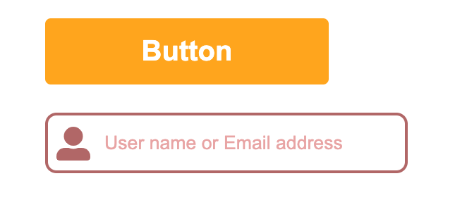

# 作ってみよう１

### 見本

### 備考

- カラー・細かい数値は問いません
- 基本的な部分があっているかみて見てください！
- (レイアウトを気にする課題の場合は)レスポンシブ対応できるかも挑戦しましょう

#### 作ってみようの解き方・提出方法

1. [テンプレート](https://codesandbox.io/s/zuotutemiyou1-knsgj?file=/index.html)を開く
2. 画面右上の`Sign in`から github アカウントでログインする
3. 画面右上の`Fork`を押し、提出用に複製する(URL が新しく発行され、他者が見られるようになります)
4. 課題のデザインを作る(Ctrl+S または Command+S で自分のコードが保存され、見た目に反映されます)

### 答え

https://codesandbox.io/s/zuotutemiyou1--dae-qzmcu

## みんなの答え

- [yuto](https://codepen.io/yuto-tus/pen/LYRVrEp) (添削)
- [mashu](https://codepen.io/mashumashumashu/pen/poEJVBZ?editors=1100)
- [haru](https://codepen.io/haruki00000000/pen/eYdNKYX)
- [takahiro](https://codepen.io/okathira/pen/jOMPxgK)
- [sho](https://codepen.io/sho-ing/pen/XWjbYWw)
- [keisuke](https://codepen.io/mikeazaleaakane/pen/WNGvyvJ)

参加者：`risa(shimura)`,`risa(tanaka)` 初回なのでうまくリンク発行できず、、、

### 振り返り

- 作業時間 15 分 レビュー 15 分
- 思ったよりも時間がかかって１問で十分だった気がする
- code pen は github などでログインしてからリンク踏んでもらう
