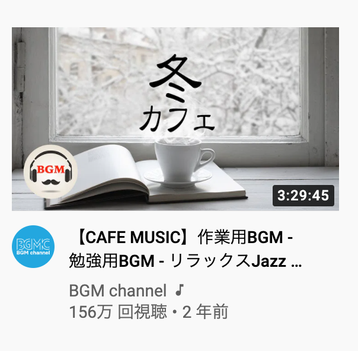

# 作ってみよう

### 見本

| level1                                    |
| ----------------------------------------- |
|  |

| level2                                    |
| ----------------------------------------- |
|  |

### 備考

- カラー・細かい数値は問いません
- 基本的な部分があっているかみて見てください！
- (レイアウトを気にする課題の場合は)レスポンシブ対応できるかも挑戦しましょう

### テンプレート

- [level1](https://codesandbox.io/s/zuotutemiyou3-level1-ep2ff?file=/index.html)
- [level2](https://codesandbox.io/s/zuotutemiyou3-level2-doh4d?file=/index.html)

#### 作ってみようの解き方・提出方法

1. テンプレートを開く
2. 画面右上の`Sign in`から github アカウントでログインする
3. 画面右上の`Fork`を押し、提出用に複製する(URL が新しく発行され、他者が見られるようになります)
4. 課題のデザインを作る(Ctrl+S または Command+S で自分のコードが保存され、見た目に反映されます)

### 答え

- [level1](https://codesandbox.io/s/zuotutemiyou3-level1--dae-we5fx)
- [level2](https://codesandbox.io/s/zuotutemiyou-3-level2--dae-oy1vb)

## みんなの答え

- [keisuke](https://codepen.io/mikeazaleaakane/pen/JjRWrwy) 添削
- [risa_shimura](https://codepen.io/risa-shimura/pen/ZEpeXqW)
- [nakayama](https://codepen.io/nakayama8320/pen/rNMyGZL) 添削
- [haru](https://codepen.io/haruki00000000/pen/OJRpxYG)
- [takahiro](https://codepen.io/okathira/pen/KKgWXeP)

mashu ...URL うまく発行できず...

### 振り返り

- テンプレートからきちんと作ってもらう

### 参考リンク

- https://www.aozora-blog.com/2018/07/22/post-151/
- https://developer.mozilla.org/ja/docs/Web/CSS/box-flex
