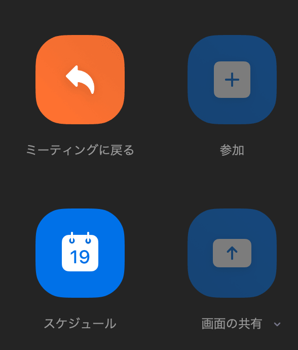
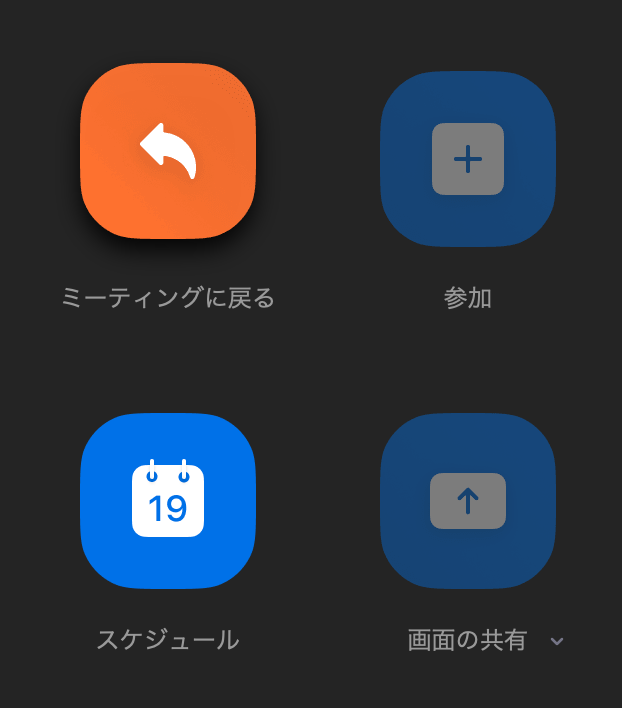

# 作ってみよう 4

### 見本

| 通常                                  | ホバー時                                             |
| ------------------------------------- | ---------------------------------------------------- |
|  |  |

### 備考

- これは zoom でミーティング中なので参加と画面共有ボタンは使えないようになっています
- ミーティングに戻るボタンはアクティブ状態ですね
- ホバーした時に shadow と上に少し移動します
- カラー・細かい数値は問いません
- 基本的な部分があっているかみて見てください！
- (レイアウトを気にする課題の場合は)レスポンシブ対応できるかも挑戦しましょう

#### 作ってみようの解き方・提出方法

1. [テンプレート](https://codesandbox.io/s/zuotutemiyou4-u30ik?file=/index.html)を開く
2. 画面右上の`Sign in`から github アカウントでログインする
3. 画面右上の`Fork`を押し、提出用に複製する(URL が新しく発行され、他者が見られるようになります)
4. 課題のデザインを作る(Ctrl+S または Command+S で自分のコードが保存され、見た目に反映されます)

### 答え

https://codesandbox.io/s/zuotutemiyou-4--dae-2k2x7?file=/index.html

## みんなの答え

- [haru](https://codepen.io/haruki00000000/pen/xxEXKqe)(添削)
- [takahiro](https://codepen.io/okathira/pen/jOMGNPL)
- [risa_shimura](https://codepen.io/risa-shimura/pen/XWjerbB)
- [risa](https://codepen.io/risa05/pen/VwKMZbY)
- [sho](https://codepen.io/sho-ing/pen/xxEXKde)
- [yuto](https://codepen.io/yuto-tus/pen/dypVbRy)

### 振り返り

- 親要素で配置すると楽(flex,grid)
- :hover に transition...？
- button に disabled 属性あるよね
- hover,disabled,:not()とか擬似クラスいっぱいあるね
- 20 分でギリギリできないくらいが良い(時間を持て余さない＆応用部分はライブコーディングで教えられる)
