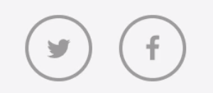

# 作ってみよう 6

### 見本

- 1 問目はこのようにしてみてください。わかりづらいですが、hover すると外側から内側に色が変わります。
- 2 問目は既に形にはなっているリストをより良い方法に実装し直してください。

### 備考

- カラー・細かい数値は問いません
- 基本的な部分があっているかみて見てください！
- (レイアウトを気にする課題の場合は)レスポンシブ対応できるかも挑戦しましょう

#### 作ってみようの解き方・提出方法

1. [テンプレート](https://codesandbox.io/s/zuotutemiyou6-5ixmz?file=/index.html)を開く
2. 画面右上の`Sign in`から github アカウントでログインする
3. 画面右上の`Fork`を押し、提出用に複製する(URL が新しく発行され、他者が見られるようになります)
4. 課題のデザインを作る(Ctrl+S または Command+S で自分のコードが保存され、見た目に反映されます)

### 答え

https://codesandbox.io/s/zuotutemiyou6--dae-vebvu?file=/index.html

## みんなの答え

- [yuto](https://codesandbox.io/s/zuotutemiyou6-forked-pzq0p?file=/styles.css)
- [risa_shimura](https://codesandbox.io/s/zuotutemiyou6-forked-p6kxg?file=/styles.css)
- [takahiro](https://codesandbox.io/s/zuotutemiyou6-forked-7ggxk?file=/styles.css)
- [mashu](https://codesandbox.io/s/zuotutemiyou6-forked-dzicu?file=/styles.css)

### 振り返り

こういう実装をすることでちょっと変わったアクションもできる  
今回のリスト表示の場合は答えを見てみると`flex`が一番良いですね、なぜだか考えてみましょう
gap は flexbox だと safari 対応していないので注意が必要です

- [flex vs grid](https://developer.mozilla.org/ja/docs/Web/CSS/CSS_Grid_Layout/Relationship_of_Grid_Layout)
- [gap](https://developer.mozilla.org/ja/docs/Web/CSS/gap)
