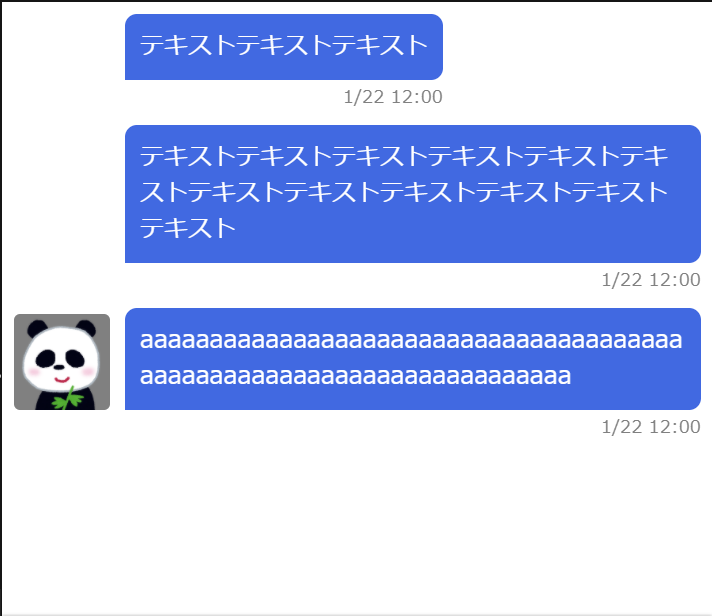

# 作ってみよう7

### 見本

- 画像は用意してあるものを使っていただいて結構です。

### 備考

- カラー・細かい数値は問いません
- 基本的な部分があっているかみて見てください！
- (レイアウトを気にする課題の場合は)レスポンシブ対応できるかも挑戦しましょう

#### 作ってみようの解き方・提出方法

1. [テンプレート](https://codesandbox.io/s/zuotutemiyou7-d30fo)を開く
2. 画面右上の`Sign in`から github アカウントでログインする
3. 画面右上の`Fork`を押し、提出用に複製する(URL が新しく発行され、他者が見られるようになります)
4. 課題のデザインを作る(Ctrl+S または Command+S で自分のコードが保存され、見た目に反映されます)

### 答え
[リンク](ttps://codesandbox.io/s/zuotutemiyou7--dae-o6yss)

## みんなの答え
[yuto](https://codesandbox.io/s/zuotutemiyou7-forked-zl6nh?file=/style.css)
[Sho](https://codesandbox.io/s/zuotutemiyou7-forked-pnbbl?file=/style.css)
[risa](https://codesandbox.io/s/zuotutemiyou7-forked-kmk3i?file=/style.css)
[takahiro](https://codesandbox.io/s/zuotutemiyou7-forked-pgb89)

### 振り返り
flexを入れ子にするとスマートに実装できることが多い。場合によってはgridも可。
takahiroさんのようにアイコン画像のあるチャット、ないチャットとして作成し並べる方法も構造としては美しい。
