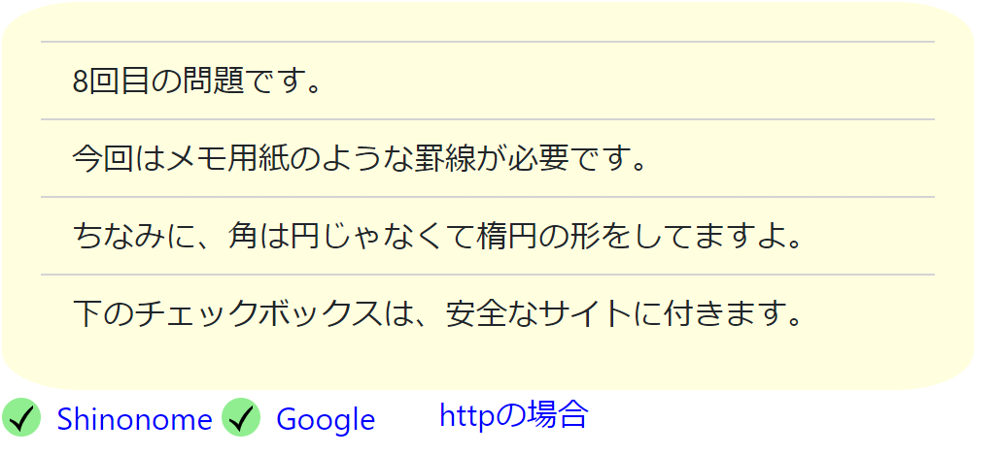

# 作ってみよう8

### 見本

✓は文字で大丈夫です。
なお、この写真は
https://svgsilh.com/svg/40319.svg
を使用しています。
### 備考

- カラー・細かい数値は問いません
- 基本的な部分があっているかみて見てください！
- (レイアウトを気にする課題の場合は)レスポンシブ対応できるかも挑戦しましょう

#### 作ってみようの解き方・提出方法

1. [テンプレート](https://codesandbox.io/s/zuotutemiyou8-r2o10?file=/index.html)を開く
2. 画面右上の`Sign in`から github アカウントでログインする
3. 画面右上の`Fork`を押し、提出用に複製する(URL が新しく発行され、他者が見られるようになります)
4. 課題のデザインを作る(Ctrl+S または Command+S で自分のコードが保存され、見た目に反映されます)

### 答え
[解答例](https://codesandbox.io/s/zuotutemiyou8jiedali-3ju3n)
## みんなの答え
[shoさん](https://codesandbox.io/s/zuotutemiyou8-forked-6ebgy?file=/style.css)
[takahiroさん](https://codesandbox.io/s/zuotutemiyou8-forked-z6dco?file=/style.css)
[risaさん](https://codesandbox.io/s/zuotutemiyou8-forked-2xo5z?file=/index.html)
[yutoさん](https://codesandbox.io/s/zuotutemiyou8-forked-89ccu?file=/style.css)
### 振り返り

＊訂正...htmlに「チェックボックス」と書いてますが、チェックボックスとはまた別のものです。今回はただのチェックアイコンです。

今回は、初めて使うだろうプロパティを紹介しました。

1. 楕円の書き方
2. linear-gradientの使い方(グラデーションをかけるときに使うこともある)
3. 属性セレクタの使い方(css dinerで出てきたので、忘れた方は復習しましょう)
4. 正規表現（今回は前方一致について扱いました。その他、後方一致、部分一致などがあります。）
5. svgで書く方法（←詳細に色を設定できるので、実際はsvgなどを使うことが多いと思います。）

詳細については、解答例の中に書いてます。
解答例を見て、その他の実装例を調べたい場合は調べてみてください。
