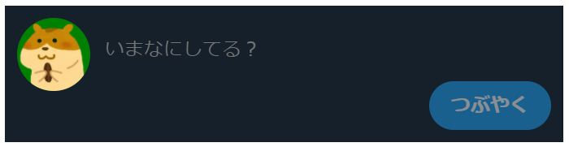

# 作ってみよう9

### 見本

入力欄に文字を入れるとボタンの表示が変わりますが、この実装は少し難しいのでまずは見た目を近づけてみましょう。
ボタンがホバーしたときなど、余裕があればいろいろ足してみてください。
（追記　入力欄を複数行入力にし、内容に合わせて高さを変える実装はjavascriptが必要となるので、今回は1行のみでいいです。）

### 備考

- カラー・細かい数値は問いません
- 基本的な部分があっているかみて見てください！
- (レイアウトを気にする課題の場合は)レスポンシブ対応できるかも挑戦しましょう

#### 作ってみようの解き方・提出方法

1. [テンプレート](https://codesandbox.io/s/zuotutemiyou9-e005j)を開く
2. 画面右上の`Sign in`から github アカウントでログインする（はじめての方はアカウントを作成してください。何かあったら講師にすぐ質問してください。）
3. 画面右上の`Fork`を押し、提出用に複製する(URL が新しく発行され、他者が見られるようになります)
4. 課題のデザインを作る(Ctrl+S または Command+S で自分のコードが保存され、見た目に反映されます)

### 答え
[解答例](https://codesandbox.io/s/zuotutemiyou9jiedali-ewwpf?file=/index.html)
## みんなの答え
[yutoさん](https://codesandbox.io/s/zuotutemiyou9-forked-38yrb?file=/style.css)
[takahiroさん](https://codesandbox.io/s/zuotutemiyou9-forked-shc5g?file=/style.css)
[risaさん](https://codesandbox.io/s/zuotutemiyou9-forked-5qgq2?file=/style.css)
### 振り返り

