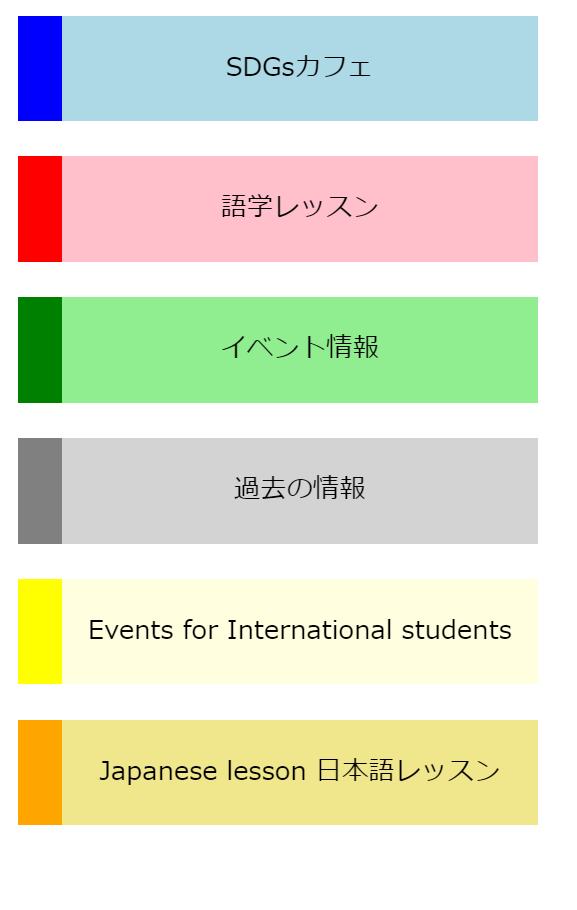

# 作ってみよう10

### 見本

### 備考
- 解答例は以下の色を使用しています。できれば下の色を使いましょう。
文字の色...black

|メインの色|左側の色   |
| ----------- | ----------- |
| lightblue   | blue          |
| pink          | red            |
| lightgreen |green        |
| lightgray   | gray          |
|lightyellow| yellow       |
| khaki         | ornage     |

- さまざまな書き方があるので、早くできたら他の書き方でどのような書き方があるか書いておきましょう。
- カラー・細かい数値は問いません
- 基本的な部分があっているかみて見てください！
- (レイアウトを気にする課題の場合は)レスポンシブ対応できるかも挑戦しましょう

#### 作ってみようの解き方・提出方法

1. [テンプレート](https://codesandbox.io/s/zuotutemiyou10-8477u?file=/index.html)を開く
2. 画面右上の`Sign in`から github アカウントでログインする
3. 画面右上の`Fork`を押し、提出用に複製する(URL が新しく発行され、他者が見られるようになります)
4. 課題のデザインを作る(Ctrl+S または Command+S で自分のコードが保存され、見た目に反映されます)

### 答え
[解答例](https://codesandbox.io/s/zuotutemiyou10jiedali-98lxb)
## みんなの答え
[yutoさん](https://codesandbox.io/s/zuotutemiyou10-forked-83pno?file=/style.css)
[takahiroさん](https://codesandbox.io/s/zuotutemiyou10-forked-id8bl?file=/style.css)
[nanakoさん](https://codesandbox.io/s/zuotutemiyou10-forked-fzc0d?file=/style.css)
[risaさん](https://codesandbox.io/s/zuotutemiyou10-forked-b14tg?file=/style.css)
[tamakoさん](https://codesandbox.io/s/zuotutemiyou10-forked-05g2d)
### 振り返り
1. 色違い、大きさ違いなどは、「共通の部分」と「個別に指定する部分」に分けてクラスを分ける。
例
- [Bootstrapのbutton](https://getbootstrap.com/docs/5.0/components/buttons/)
`btn`はボタンで共通で持っておくスタイル、`btn-primary`は個別で指定したいもの
- [Bulmaのbutton](https://bulma.io/documentation/elements/button/)
これも、大きさ違いは`is-large`などのクラスを使っている。

2. 縦並びにする方法はいくつかある。
- notを使う
- nth-childでnを使う
- ふくろうセレクタ
などがある。それぞれ解答例の中で紹介してます。