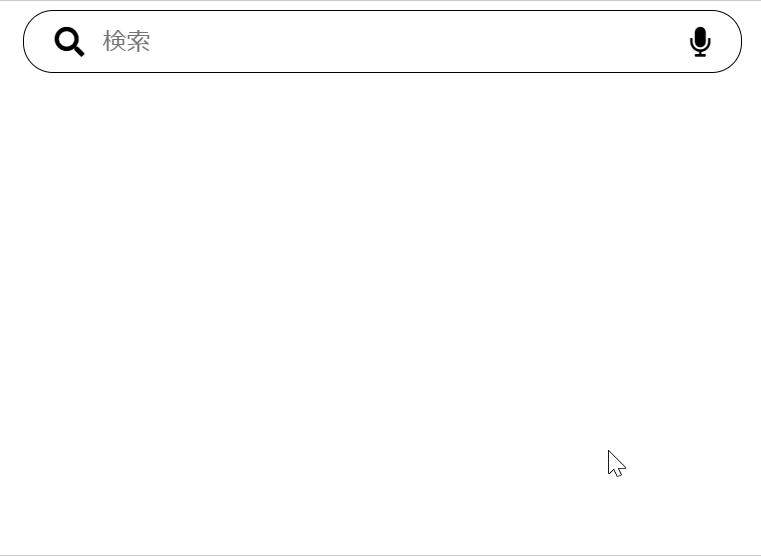

# 作ってみよう

### 見本

### 備考

- カラー・細かい数値は問いません
- 基本的な部分があっているかみて見てください！
- (レイアウトを気にする課題の場合は)レスポンシブ対応できるかも挑戦しましょう

#### 作ってみようの解き方・提出方法

1. [テンプレート](https://codesandbox.io/s/zuotutemiyou11-ewoq8)を開く
2. 画面右上の`Sign in`から github アカウントでログインする
3. 画面右上の`Fork`を押し、提出用に複製する(URL が新しく発行され、他者が見られるようになります)
4. 課題のデザインを作る(Ctrl+S または Command+S で自分のコードが保存され、見た目に反映されます)

### 答え

[解答例](https://codesandbox.io/s/zuotutemiyou11-jiedali-q1fs0)

## みんなの答え

[takahiro さん](https://codesandbox.io/s/zuotutemiyou11-forked-fhgpr?file=/style.css)
[yuto さん](https://codesandbox.io/s/zuotutemiyou11-forked-w5mpz?file=/index.html)
[nanako さん](https://codesandbox.io/s/zuotutemiyou11-forked-s2wis?file=/index.html)
[Sho さん](https://codesandbox.io/s/zuotutemiyou11-forked-05g38?file=/index.html)
[Takeuchi さん](https://codesandbox.io/s/zuotutemiyou11-forked-10u7q)
[Tamako Aiba さん](https://codesandbox.io/s/zuotutemiyou11-forked-8g7f3)
[risa さん](https://codesandbox.io/s/zuotutemiyou11-forked-cwl10?file=/style.css)

### 振り返り

- input 要素に対して疑似クラス「:focus」や、その親要素に対して「:focus-within」を活用してスタイルを指定することで、input に入力中のみ見た目が変わるといった実装が可能になる。
- 加えて兄弟要素を参照するセレクタ「~」を利用することで、ある要素の状態(ホバー等)によって別の要素の見た目を変更する実装も可能となる。
