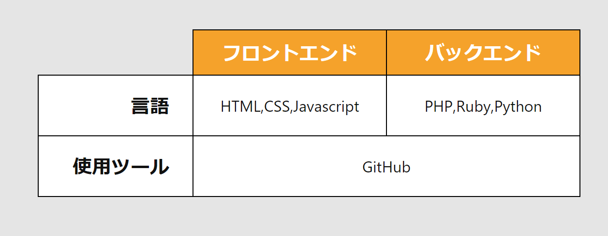

# 作ってみよう 12

### 見本

### 備考

- カラー・細かい数値は問いません
- 基本的な部分があっているかみて見てください！
- (レイアウトを気にする課題の場合は)レスポンシブ対応できるかも挑戦しましょう

#### 作ってみようの解き方・提出方法

1. [テンプレート](https://codesandbox.io/s/zuotutemiyou12-68y1n)を開く
2. 画面右上の`Sign in`から github アカウントでログインする
3. 画面右上の`Fork`を押し、提出用に複製する(URL が新しく発行され、他者が見られるようになります)
4. 課題のデザインを作る(Ctrl+S または Command+S で自分のコードが保存され、見た目に反映されます)

### 答え

[解答例](https://codesandbox.io/s/zuotutemiyou12jiedali-zdrbm)

## みんなの答え

- [takahiro さん](https://codesandbox.io/s/zuotutemiyou12-forked-wcwju?file=/style.css)
- [risa さん](https://codesandbox.io/s/zuotutemiyou12-forked-ongbq?file=/style.css)
- [yuto さん](https://codesandbox.io/s/zuotutemiyou12-forked-rfrlq?file=/style.css)
- [nanako さん](https://codesandbox.io/s/zuotutemiyou12-forked-k6c0j?file=/style.css)
- [takeuchi さん](https://codesandbox.io/s/zuotutemiyou12-forked-xjlc1?file=/style.css)
- [tamako さん](https://codesandbox.io/s/zuotutemiyou12-forked-hwlfm)

### 振り返り

- table レイアウトの構成について
- セルを結合させるときは`rowspan`や`colspan`を用いる
- table の border 属性や align 属性は非推奨になっているので、css で指定するようにしよう
- 境界線を結合するときは`table`に`border-collapse`（bootstrap を用いていたら結合されている）
