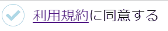

# 作ってみよう

### 見本

input type="checkbox"を使って、ON/OFF の状態を持てるようにしましょう。ただ、input は見た目がブラウザに依存して変更できずデザイン的に不都合なため、input 本体は表示せず代わりの要素をクリックさせたいです。label と checkbox 用の疑似クラス、隣接セレクタを使って実装してみましょう。

### 備考

- カラー・細かい数値は問いません
- 基本的な部分があっているかみて見てください！
- (レイアウトを気にする課題の場合は)レスポンシブ対応できるかも挑戦しましょう

#### 作ってみようの解き方・提出方法

1. [テンプレート](https://codesandbox.io/s/zuotutemiyou13-x31nt)を開く
2. 画面右上の`Sign in`から github アカウントでログインする
3. 画面右上の`Fork`を押し、提出用に複製する(URL が新しく発行され、他者が見られるようになります)
4. 課題のデザインを作る(Ctrl+S または Command+S で自分のコードが保存され、見た目に反映されます)

### 答え

[解答例](https://codesandbox.io/s/zuotutemiyou13jiedali-0i843?file=/style.css)

## みんなの答え

[Sho さん](https://codesandbox.io/s/zuotutemiyou13-forked-jl7dk?file=/style.css)
[yuto さん](https://codesandbox.io/s/zuotutemiyou13-forked-s8ywb?file=/style.css)
[TamakoAiba さん](https://codesandbox.io/s/zuotutemiyou13-forked-o0sfn)
[Takeuchi さん](https://codesandbox.io/s/zuotutemiyou13-forked-8qjit?file=/style.css)

### 振り返り

input type="checkbox"がチェックされている場合のスタイルは:checked 疑似クラスを利用するとよい
