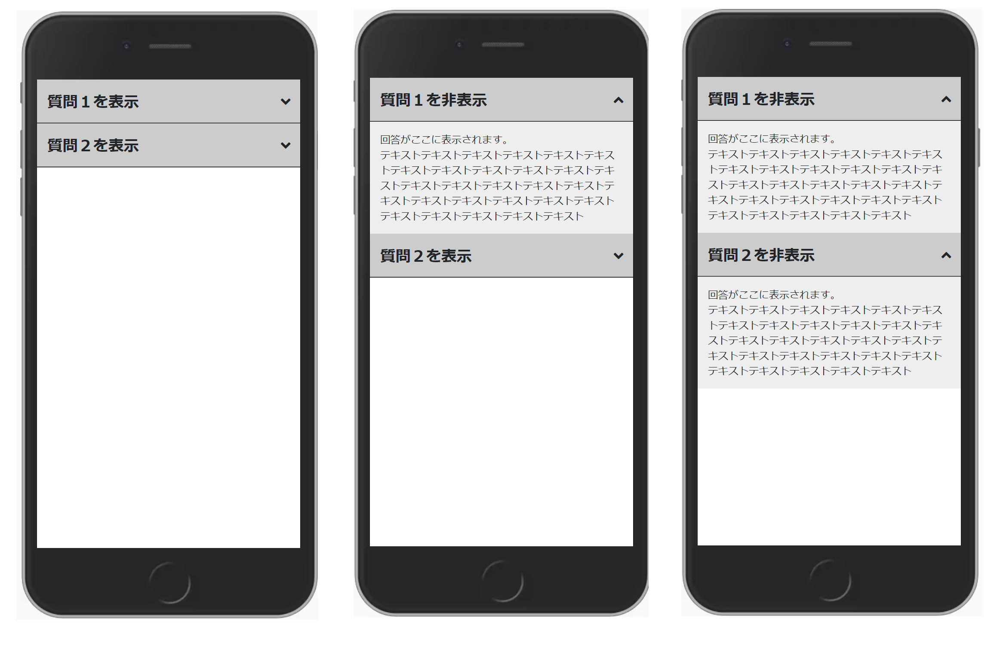

# 作ってみよう 14

### 見本

1. まず、写真の左側の見た目になるようにしてみましょう。

1. ボタンを押した領域の文字と矢印の向きを切り替えるようにしましょう。[前回](./210305.md)学んだことを参考にしましょう。

1. 真ん中や右の写真のように、濃い灰色の領域を押すと、対応する回答が表示されるようにしましょう。

### 備考

- カラー・細かい数値は問いません
- 基本的な部分があっているかみて見てください！
- (レイアウトを気にする課題の場合は)レスポンシブ対応できるかも挑戦しましょう

#### 作ってみようの解き方・提出方法

1. [テンプレート](https://codesandbox.io/s/zuotutemiyou14-o0h2z)を開く
2. 画面右上の`Sign in`から github アカウントでログインする
3. 画面右上の`Fork`を押し、提出用に複製する(URL が新しく発行され、他者が見られるようになります)
4. 課題のデザインを作る(Ctrl+S または Command+S で自分のコードが保存され、見た目に反映されます)

### 答え

[解答例](https://codesandbox.io/s/zuotutemiyou14jiedali-25c32)

## みんなの答え

- [yuto さん](https://codesandbox.io/s/zuotutemiyou14-forked-ockyb?file=/style.css)

- [nanako さん](https://codesandbox.io/s/zuotutemiyou14-forked-lnyv6?file=/style.css)

- [risa さん](https://codesandbox.io/s/zuotutemiyou14-forked-1d551?file=/style.css)

- [tamako さん](https://codesandbox.io/s/zuotutemiyou14-forked-blq77)

### 振り返り

- インライン要素とブロック要素について
- 見えなくするときは`display; none;`などを使う
