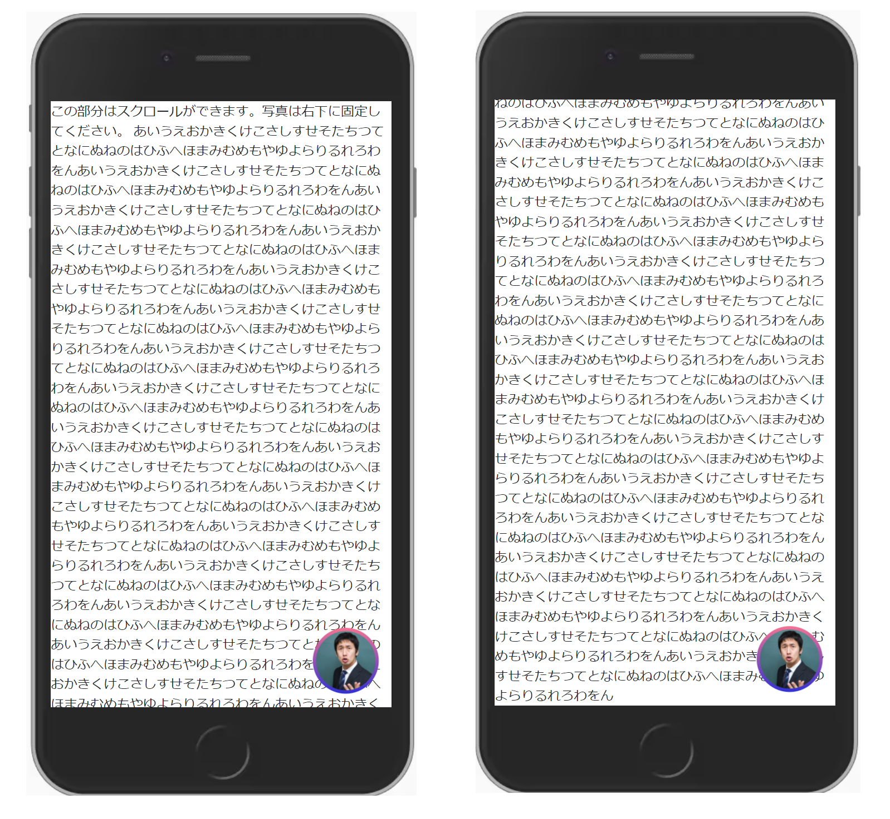

# 作ってみよう 16

### 見本

時間が余ったら他にどうやればできるのか試して、どれが最適か考えてみてください。

### 備考

- カラー・細かい数値は問いません
- 基本的な部分があっているかみて見てください！
- (レイアウトを気にする課題の場合は)レスポンシブ対応できるかも挑戦しましょう

#### 作ってみようの解き方・提出方法

1. [テンプレート](https://codesandbox.io/s/zuotutemiyou16-71dy1?file=/index.html)を開く
2. 画面右上の`Sign in`から github アカウントでログインする
3. 画面右上の`Fork`を押し、提出用に複製する(URL が新しく発行され、他者が見られるようになります)
4. 課題のデザインを作る(Ctrl+S または Command+S で自分のコードが保存され、見た目に反映されます)

### 答え

[解答例](https://codesandbox.io/s/zuotutemiyou16jiedali-tnhpf)

## みんなの答え

[takeuchi さん](https://codesandbox.io/s/zuotutemiyou16-forked-hu5ch?file=/style.css:83-91)

### 振り返り

- 固定した位置に表示するには`position: fixed;`を使う。

- 現時点で border に直接グラデーションを書く方法はないので、`calc`を使って大きさを調整して border のように見せる方法で作る。
