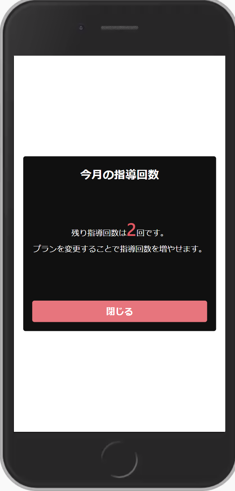

# 作ってみよう 16

### 見本

- 課題１. html には適切なタグがありますが、全部 div タグで記述されています。div タグ以外が望ましい場合は適切なタグに直しましょう。また、他にタグが必要であれば補いましょう。
- 課題２. 写真のようになるように style.css に記述しましょう。
- 課題３. 時間が余ればレスポンシブ対応しましょう。(案件レベル)

### 備考

- カラー・細かい数値は問いません
- 基本的な部分があっているかみて見てください！
- (レイアウトを気にする課題の場合は)レスポンシブ対応できるかも挑戦しましょう

#### 作ってみようの解き方・提出方法

1. [テンプレート](https://codesandbox.io/s/zuotutemiyou18-e1lts)を開く
2. 画面右上の`Sign in`から github アカウントでログインする
3. 画面右上の`Fork`を押し、提出用に複製する(URL が新しく発行され、他者が見られるようになります)
4. 課題のデザインを作る(Ctrl+S または Command+S で自分のコードが保存され、見た目に反映されます)

### 答え

[解答例](https://codesandbox.io/s/zuotutemiyou18jiedali-65ovt)

## みんなの答え

- [yuto さん](https://codesandbox.io/s/zuotutemiyou18-forked-j136t?file=/style.css)
- [tamako さん](https://codesandbox.io/s/zuotutemiyou18-forked-pbr7j)
- [nanako さん](https://codesandbox.io/s/zuotutemiyou18-forked-o3zlc?file=/style.css)

### 振り返り

- html には適切なタグがある
- padding と margin の違いについて
- レスポンシブ対応で`max-width`や関数の`min()`が有効。こうすると、細かいメディアクエリがいらなくなる。
