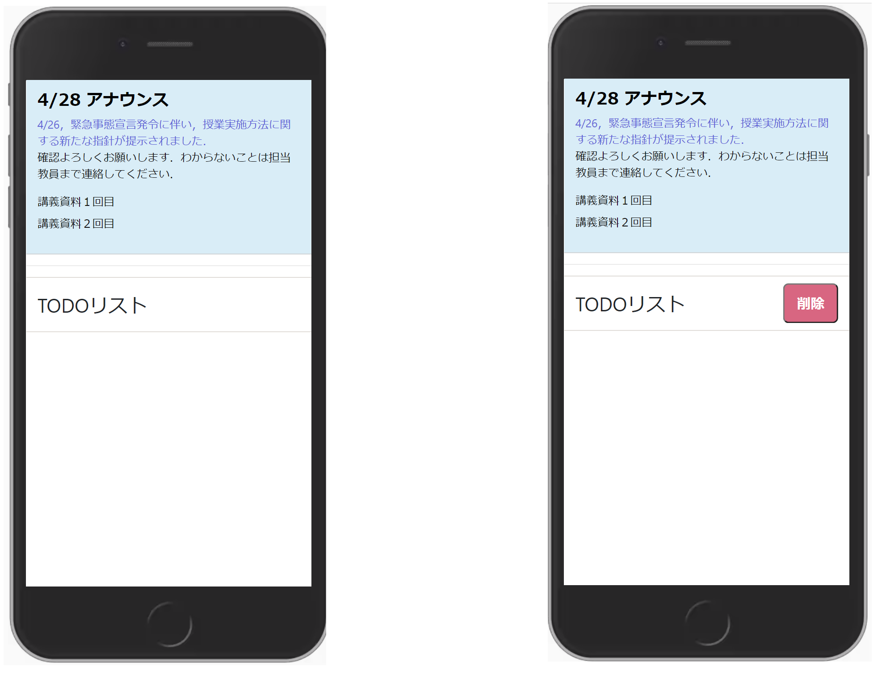

# 作ってみよう

### 見本

- 課題１（上の課題）：すでにコードが完成していますが、書き方が間違っている部分が 4 箇所あります。レビュワーだったらどこを指摘するか考えましょう。改善案がわかれば直しましょう。
- 課題２（下の課題）：TODO リストをホバーした時にボタンが表示されるようにしましょう、

### 備考

- カラー・細かい数値は問いません
- 基本的な部分があっているかみて見てください！
- (レイアウトを気にする課題の場合は)レスポンシブ対応できるかも挑戦しましょう

#### 作ってみようの解き方・提出方法

1. [テンプレート](https://codesandbox.io/s/zuotutemiyou20-e1vjw?file=/index.html)を開く
2. 画面右上の`Sign in`から github アカウントでログインする
3. 画面右上の`Fork`を押し、提出用に複製する(URL が新しく発行され、他者が見られるようになります)
4. 課題のデザインを作る(Ctrl+S または Command+S で自分のコードが保存され、見た目に反映されます)

### 答え

[解答例](https://codesandbox.io/s/zuotutemiyou20jiedali-bq9vk?file=/index.html)

## みんなの答え

- [nanako さん](https://codesandbox.io/s/zuotutemiyou20-forked-vxh37?file=/style.css)
- [risa さん](https://codesandbox.io/s/zuotutemiyou20-forked-4ljl4?file=/style.css)
- [yuto さん](https://codesandbox.io/s/zuotutemiyou20-forked-hrtr4?file=/style.css)
- [kazuki さん](https://codesandbox.io/s/zuotutemiyou20-forked-q2sy7?file=/style.css)
-

### 振り返り

- 入れ子のルールについて（フレージングコンテンツ・フローコンテンツなど）
- float は非推奨
- margin と padding の使い分けについて
- hover した時にその子要素のスタイルが変更する方法について

- 参考になる記事
- [今更ながら HTML5 のコンテンツモデルとカテゴリについて整理する](https://qiita.com/yamaking/items/b831ad8d4f7aca599e8b)
- [入れ子チートシート](https://yoshikawaweb.com/element/)
