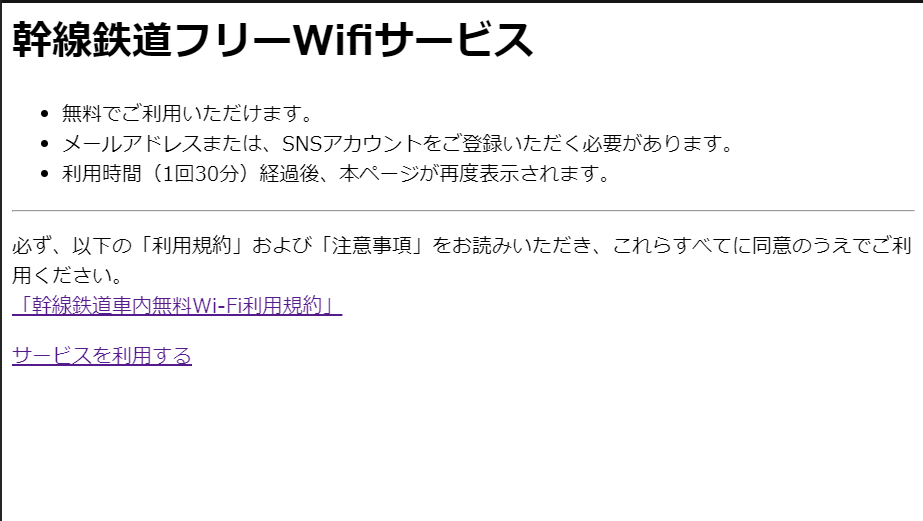
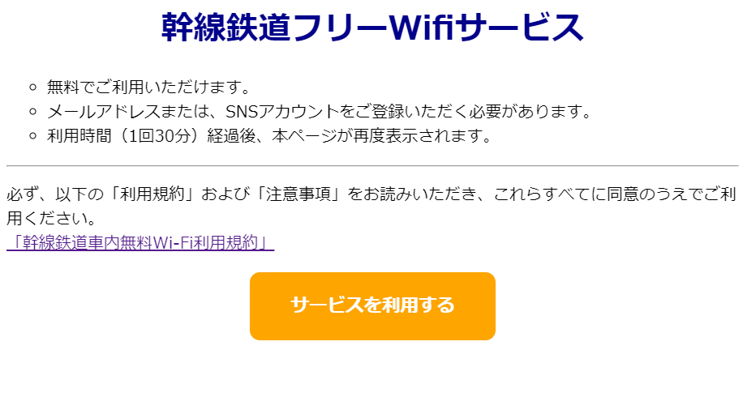

# 作ってみよう

### 見本

- まず、下の画像の表示になるよう index.html を書いてみましょう。元々配置してある文を適切なタグで囲んだり、区切り線を表すタグを追加したりしてください。この時点では CSS は不要です。
  

  - ヒント：リンクを表すタグにはリンク先を指定しないとうまく表示されません。今回は適当に"."と指定しておいてください。"."は現在のページを表します。

- それができたら、style.css に CSS を書いて下の完成形を目指しましょう。
  

### 備考

- カラー・細かい数値は問いません
- 基本的な部分があっているかみて見てください！
- (レイアウトを気にする課題の場合は)レスポンシブ対応できるかも挑戦しましょう

#### 作ってみようの解き方・提出方法

1. [テンプレート](https://codesandbox.io/s/zuotutemiyou21-c3bjp)を開く
2. 画面右上の`Sign in`から github アカウントでログインする
3. 画面右上の`Fork`を押し、提出用に複製する(URL が新しく発行され、他者が見られるようになります)
4. 課題のデザインを作る(Ctrl+S または Command+S で自分のコードが保存され、見た目に反映されます)

### 答え

https://codesandbox.io/s/zuotutemiyou21jiedali-h4tlm

## みんなの答え

[nanako](https://codesandbox.io/s/zuotutemiyou21-forked-d6gjq?file=/style.css)
[higashiji](https://codesandbox.io/s/zuotutemiyou21-forked-ejcit?file=/style.css)
[risa](https://codesandbox.io/s/zuotutemiyou21-forked-mcidb?file=/style.css)
[yuto](https://codesandbox.io/s/zuotutemiyou21-forked-y99wb?file=/style.css)
[fumi](https://codesandbox.io/s/zuotutemiyou21-forked-it1rh)
[Ryo Kitagawa](https://codesandbox.io/s/zuotutemiyou21-forked-bghwi?file=/index.html)
[machura](https://codesandbox.io/s/zuotutemiyou21-forked-k35o9?file=/index.html)

### 振り返り

html のタグは意味に沿って使いましょう。
ul タグの囲う範囲に注意
