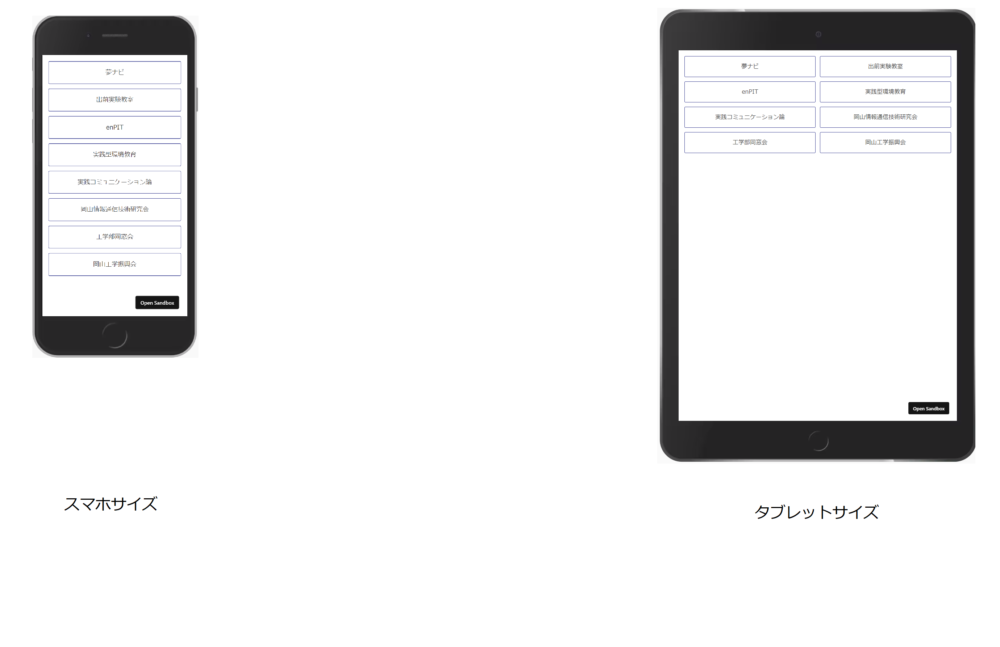
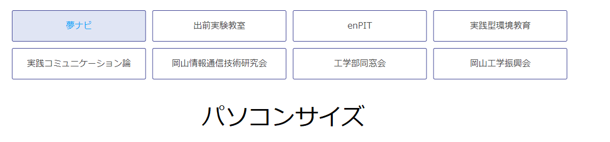

# 作ってみよう

### 見本

全部リンクは新しいウィンドウで開きますので注意してください。

- 課題１：適切なタグに変更しましょう。
- 課題２：見本のようになるようにスタイルを当てましょう。マウスが乗った時の挙動も再現しましょう。
- 課題３：画面幅が変わった時に並ぶ数が変更されるようにしましょう。

### 備考

- カラー・細かい数値は問いません
- 基本的な部分があっているかみて見てください！
- (レイアウトを気にする課題の場合は)レスポンシブ対応できるかも挑戦しましょう

#### 作ってみようの解き方・提出方法

1. [テンプレート](https://codesandbox.io/s/zuotutemiyou22-xztly)を開く
2. 画面右上の`Sign in`から github アカウントでログインする
3. 画面右上の`Fork`を押し、提出用に複製する(URL が新しく発行され、他者が見られるようになります)
4. 課題のデザインを作る(Ctrl+S または Command+S で自分のコードが保存され、見た目に反映されます)

### 答え

- [解答例](https://codesandbox.io/s/zuotutemiyou22jiedali-n1f11?file=/style.css)
- [参考・flexbox を用いた場合](https://codesandbox.io/s/zuotutemiyou22jiedali2-8niri?file=/index.html)

## みんなの答え

- [yuto さん](https://codesandbox.io/s/zuotutemiyou22-forked-3thxu)
- [kazuki さん](https://codesandbox.io/s/zuotutemiyou22-forked-t4dtq)
- [ryo kitagawa さん](https://codesandbox.io/s/zuotutemiyou22-forked-vn8wq)

### 振り返り

- grid layout を使ったら 2 方向のレイアウトが便利なので使い方を覚えると良いです。
- 別タブで開く場合について
