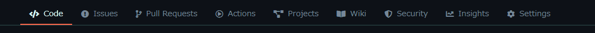

# 作ってみよう

### 見本

- アイコン、文字は用意したので、それらを適切なタグで囲い、CSS で見た目をお手本に近づけましょう。
- 本日のポイント
  - hover 疑似クラスの復習
  - border のつけ方
  - 正規表現を使った置換による時短
  - fontawesome とは

### 備考

- カラー・細かい数値は問いません
- 基本的な部分があっているかみて見てください！
- (レイアウトを気にする課題の場合は)レスポンシブ対応できるかも挑戦しましょう

#### 作ってみようの解き方・提出方法

1. [テンプレート](https://codesandbox.io/s/zuotutemiyou23-lwk6d)を開く
2. 画面右上の`Sign in`から github アカウントでログインする
3. 画面右上の`Fork`を押し、提出用に複製する(URL が新しく発行され、他者が見られるようになります)
4. 課題のデザインを作る(Ctrl+S または Command+S で自分のコードが保存され、見た目に反映されます)

### 答え

https://codesandbox.io/s/zuotutemiyou23jiedali-j20se?file=/index.html

## みんなの答え

[yuto](https://codesandbox.io/s/zuotutemiyou23-forked-d679o?file=/style.css)
[risa](https://codesandbox.io/s/zuotutemiyou23-forked-zqv54?file=/style.css)
[nanako](https://codesandbox.io/s/zuotutemiyou23-forked-mbjk2?file=/style.css:128-135)
[ryo_matsuyama](https://codesandbox.io/s/zuotutemiyou23-forked-xj1b3?file=/style.css)
[onokazu](https://codesandbox.io/s/zuotutemiyou23-forked-rg9x6?file=/style.css)
[higashiji](https://codesandbox.io/s/zuotutemiyou23-forked-f6q2s?file=/index.html)
[YuiHanami](https://codesandbox.io/s/zuotutemiyou23-forked-ltibb?file=/style.css)

### 振り返り

- hover 疑似クラスでカーソル当てた時の挙動を作れる。その際に html 要素の階層に注意。
- 複数の要素をそれぞれタグで囲むときとかは正規表現を使った置換をすると早い
- （補足）fontawesome とはアイコンを文字（フォント）としてページに埋め込めるサービス。公式サイトに使い方乗ってるのでチェックしておくといつか役に立つ。
