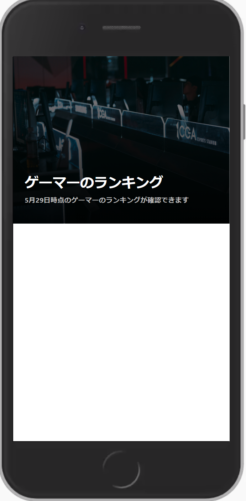

# 作ってみよう

### 見本

写真は[ぱくたそ](https://www.pakutaso.com/20201051303cgae.html)を使用

### 備考

- カラー・細かい数値は問いません
- 基本的な部分があっているかみて見てください！
- (レイアウトを気にする課題の場合は)レスポンシブ対応できるかも挑戦しましょう

#### 作ってみようの解き方・提出方法

1. [テンプレート](https://codesandbox.io/s/zuotutemiyou24-yjvf0)を開く
2. 画面右上の`Sign in`から github アカウントでログインする
3. 画面右上の`Fork`を押し、提出用に複製する(URL が新しく発行され、他者が見られるようになります)
4. 課題のデザインを作る(Ctrl+S または Command+S で自分のコードが保存され、見た目に反映されます)

### 答え

[解答例](https://codesandbox.io/s/zuotutemiyou24jiedali-t88o9)

## みんなの答え

- [kazuki](https://codesandbox.io/s/zuotutemiyou24-forked-2qf4r?file=/style.css)
- [risa](https://codesandbox.io/s/zuotutemiyou24-forked-n8ecm?file=/style.css)

### 振り返り

- position の使い方
- 背景画像と普通の画像の違いについて
- 背景に影をかける方法について
