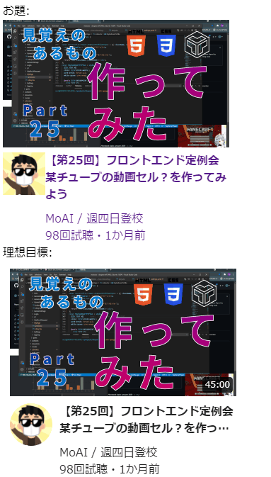

# 作ってみよう

### 見本

- まずは上側のものを目指して書いてみてください。今回の最大の目標はこの配置を作ることです。細かい余白とかは大雑把でいいです。
- タイトルやチャンネル名、再生回数等はなんでもいいです。
- 余裕がある方は下の完成品を目指してみてください。動画の長さの表示、ユーザーアイコンの角丸表示、動画タイトルの行数制限・"..."表示、細かい余白や文字色の設定のうち出来そうなものから取り組んでください。

### 備考

- カラー・細かい数値は問いません
- 基本的な部分があっているかみて見てください！
- (レイアウトを気にする課題の場合は)レスポンシブ対応できるかも挑戦しましょう

#### 作ってみようの解き方・提出方法

1. [テンプレート](https://codesandbox.io/s/zuotutemiyou25-xnfb5?file=/style.css)を開く
2. 画面右上の`Sign in`から github アカウントでログインする
3. 画面右上の`Fork`を押し、提出用に複製する(URL が新しく発行され、他者が見られるようになります)
4. 課題のデザインを作る(Ctrl+S または Command+S で自分のコードが保存され、見た目に反映されます)

### 答え

https://codesandbox.io/s/zuotutemiyou25jiedali-57lww

## みんなの答え

[risa](https://codesandbox.io/s/zuotutemiyou25-forked-5zx80?file=/style.css)
[higashiji](https://codesandbox.io/s/zuotutemiyou25-forked-j3me8?file=/style.css)
[ryohei](https://codesandbox.io/s/zuotutemiyou25-forked-s4j6n)

### 振り返り

- 複雑なレイアウトを見たら、どう分割するかを考えて、それをもとに HTML を書いていくとよい。
