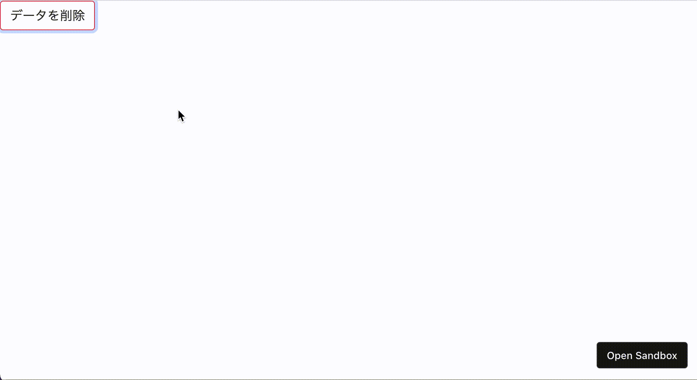

# 作ってみよう

### 見本

- Bootstrap の[modal](https://getbootstrap.com/docs/5.0/components/modal/)を読んで、取り組んでみましょう。
- 動画を見ると

1. 中央寄せ
2. キャンセルボタンとバツボタン以外ではモーダルは閉じない
   ようになってますので、そうなるようにしてみましょう、

### 備考

- カラー・細かい数値は問いません
- 基本的な部分があっているかみて見てください！
- (レイアウトを気にする課題の場合は)レスポンシブ対応できるかも挑戦しましょう

#### 作ってみようの解き方・提出方法

1. [テンプレート](https://codesandbox.io/s/zuotutemiyou26-ubqo1)を開く
2. 画面右上の`Sign in`から github アカウントでログインする
3. 画面右上に`Fork`ボタンがある場合は押して、提出用に複製する(URL が新しく発行され、他者が見られるようになります) 無い場合は一回ファイルを保存(Ctrl+S または Command+S)すると自動的に Fork されます。
4. 課題のデザインを作る(Ctrl+S または Command+S で自分のコードが保存され、見た目に反映されます)

### 答え

- [解答例](https://codesandbox.io/s/zuotutemiyou26jiedali-t3dg5)

## みんなの答え

- [risa](https://codesandbox.io/s/zuotutemiyou26-forked-03tnw?file=/style.css)
- [maaya](https://codesandbox.io/s/zuotutemiyou26-forked-x33tr?file=/style.css)
- [higashiji](https://codesandbox.io/s/zuotutemiyou26-forked-sgmpi?file=/style.css)

### 振り返り

- Boostrap の便利な機能（modal や、色を変える方法）について紹介した
