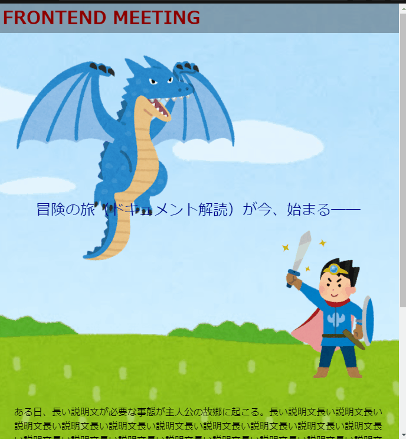

# 作ってみよう

### 見本

最終目標

まず、下の状態を目指して作成しましょう。

優先事項

- ヘッダーを画面上に固定する。
- 画像とキャッチコピーを配置する。

これができたら背景画像の表示もやってみましょう。

### 備考

- カラー・細かい数値は問いません
- 基本的な部分があっているかみて見てください！
- (レイアウトを気にする課題の場合は)レスポンシブ対応できるかも挑戦しましょう

#### 作ってみようの解き方・提出方法

1. [テンプレート](https://codesandbox.io/s/zuotutemiyou27-5xdrd?file=/index.html)を開く
2. 画面右上の`Sign in`から github アカウントでログインする
3. 画面右上に`Fork`ボタンがある場合は押して、提出用に複製する(URL が新しく発行され、他者が見られるようになります) 無い場合は一回ファイルを保存(Ctrl+S または Command+S)すると自動的に Fork されます。
4. 課題のデザインを作る(Ctrl+S または Command+S で自分のコードが保存され、見た目に反映されます)

### 答え

https://codesandbox.io/s/zuotutemiyou27jiedali-26ryt?file=/style.css

## みんなの答え

[Yusuke Tsukui](https://codesandbox.io/s/zuotutemiyou27-forked-b2k6v?file=/style.css)

[kazuki](https://codesandbox.io/s/zuotutemiyou27-forked-9evh1?file=/style.css)

### 振り返り

position プロパティ各種の使い方と、背景画像回りのプロパティ(background-image,background-size,background-attachment)の説明をしました。
