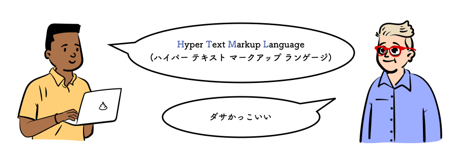
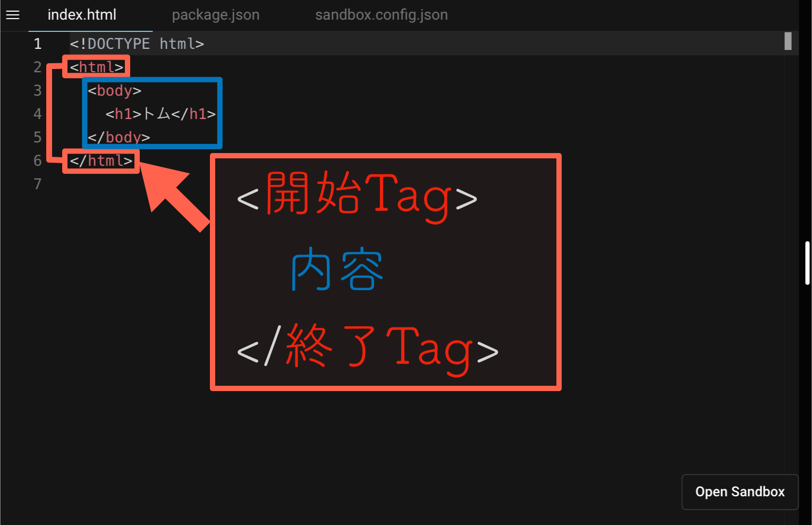

## この章で作る WEB サイトと学習内容

https://codesandbox.io/s/01-01-06-5sgkg?autoresize=1&fontsize=14&hidenavigation=1&view=preview

上記の WEB サイトを作ることで、以下を学ぶ。

- HTML とは
- 見出しの書き方
- 段落の書き方
- 箇条書きの書き方

## 学習環境を用意する

> まずは名前を画面に表示してみよう

アレンはトムにそう言うと下のテンプレートを作ってくれた。  
CodeSandbox 右下の`Open Sandbox`をクリックして編集ページを開こう。

https://codesandbox.io/s/01-01-01-znks3?autoresize=1&fontsize=14&hidenavigation=1&view=split

> WEB サイトは HTML でできている。

上記のコードは{HTML}^(エイチ ティー エム エル)だ。HTML を書くことで Web サイトを作ることができる

## HTML とは

HTML は{Tag}^(タグ)と呼ばれるコードで表示したい文章を囲むことで文書を書いていく。

::: div c2
::: div lc

:::
::: div rc
開始タグを書くと内容の始まりを表し、終了タグを書くと内容が終わったことを示す。
:::
:::

タグは１行で書いても良いし、改行して複数行に書いても良い。

```html
<h1>アレン</h1>
```

↑ どちらでも表示には影響しない。 ↓

```html
<h1>
  アレン
</h1>
```

しかし、むやみに改行すると行数がやたらと増えてしまう。  
文字数が多い時のみ改行するなど臨機応変に対応して、見やすいコードを心がけよう。

> 文章の意味ごとにタグがある。タグを覚えていくことで書ける内容が増えていく

次のページからタグを使ってみて HTML を書くことに慣れよう。

次のページに進もう。

::: div column

## コラム

### WEB は Hyper な技術？

ページを移動する時にクリックする{Link}^(リンク)も{Hyper Link}^(ハイパー リンク)と呼んだりする。Web はハイパーな技術でできている。
:::
