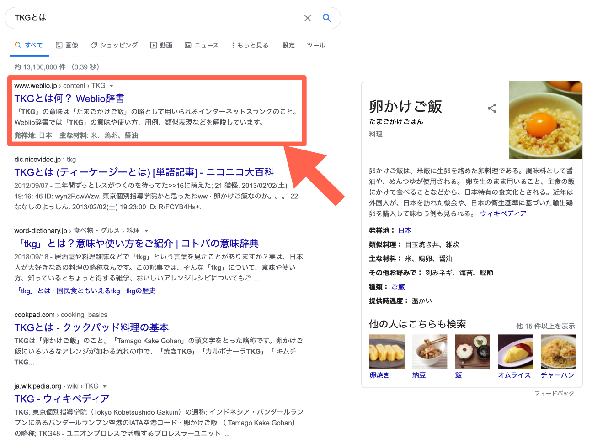

アレンが用意してくれたテンプレートを見ると「アレン」を`<h1>`で囲んでいる。`<h1>`は見出しを書きたい時に使うタグだ。

> `<h1>`の中身を自分の名前に変えてみよう

アレンはトムにそう言った。まずは完成しているものを変更するのが上達の第一歩だ。

実際に編集ページの内容を書き換えて表示を確かめてみよう。{<h1>}^(エイチワン)は見出しを意味する{heading}^(ヘッディング)の略である。

1. 14 行目`ン`と`<`の間にカーソルを持っていく
2. `アレン`の文字を削除する
3. `↩︎[エンター]`を押して改行する
4. 自分の名前を入力しよう

表示されている内容が自分の名前になっていることが確認できる。

https://codesandbox.io/s/01-01-02-8boh9?autoresize=1&fontsize=14&hidenavigation=1&view=split

表示されている内容が変更できた。ここで改めて書かれている HTML を見ていると表示されている文字とそうでない文字の違いがわかる。表示されていない文字は`<`と`>`に囲まれているのだ。{Browser}^(ブラウザ)（今使っている Edge や Chrome、Safari などのこと）は`<`と`>`を特殊な文字と認識して表示せず、タグの内容のみを表示するようにできている。その際、ブラウザはタグを使って文章を構造化している。

> タグはブラウザに文章の構造を教える特殊な文字

アレンはそう言うと次は段落を書いてみようと言った。

次のページに進もう。

::: div column

## コラム

::: div c2
::: div lc

:::
::: div rc

### なぜ構造化する必要があるのか

検索画面を見てほしい。検索結果には WEB サイトの一部のみしか表示されていない。WEB サイトの中のタイトルや見出しを自動で抜き出して表示している。WEB サイトの内容を理解してもらうために構造化する必要がある。
:::
:::
:::
