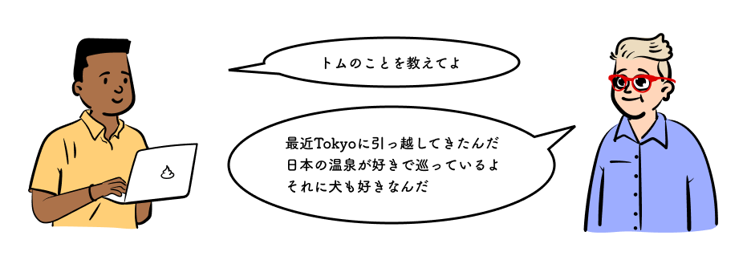

アレンはトムのプロフィールを聞いた。

> Tokyo 在住。温泉巡り、犬が好き

プロフィールを書いてみよう。HTML で文章を書く時は{<p>}^(ピー)を使う。{Paragraph}^(パラグラフ)の略で段落を意味する単語だ。このタグで文章を挟むことで文章の段落を作っていく。トムの名前の下にプロフィールを書いてみよう。16 行目`</h1>`の下に以下を書き加える。

```html
<p>
  Tokyo 在住。温泉巡り、犬が好き。
</p>
```

以下のようにトムの名前の下にプロフィールが表示される。

https://codesandbox.io/s/01-01-03-z33nc?autoresize=1&fontsize=14&hidenavigation=1&view=split

> 次は段落の中で行を変えてトムがお勧めする温泉を書いてみよう

アレンは言った。


段落の中で改行をする時は{<br />}^(ビーアール) を使う。改行を表す{Break}^(ブレイク)の略である。このように一つのタグで改行を表し終了タグのタグも存在する。下のように書く。

https://codesandbox.io/s/01-01-04-94mo3?autoresize=1&fontsize=14&hidenavigation=1&view=split

`<p>`の中に`<br />`を入れることができた。このようにタグはタグの中に書くことができる。これを入れ子構造という。  
`<br />`は`<p>`の子要素、`<p />`は`<br />`の子要素とも言う。親子関係で表すのだ。

> 複数の温泉をおすすめするなら箇条書きで書くのがベストだね

アレンはそう言うと`<p>`の中に文章を書く手を止めた。次は箇条書きを書いてみよう。

次のページに進もう。
