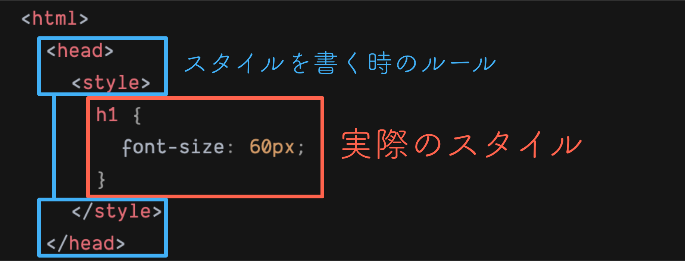

CSS は文字の大きさを変えることができる。まずはスタイルのあて方を教えよう。11 行目`<!-- ここまで設定 -->`の後ろに以下のコードを書き加える。

```html
<style>
  h1 {
    font-size: 60px;
  }
</style>
```

書き加えたコードは以下になる。トムの文字の大きさが大きくなっていることがわかる。

https://codesandbox.io/s/01-02-02-81jh3?autoresize=1&fontsize=14&hidenavigation=1&view=split

書き加えたコードに、{<style>}^(スタイル)と言う新しいタグを書いた。`<style>`は`<head>`の入れ子になっていることがわかる。`<head>`の中には画面に表示をしない設定のような内容を書いていく。

::: div c2
::: div lc

:::
::: div rc
`<head><style>`の中にスタイルを書く。スタイルは以下のようにタグを指定してあてたい Style を`{}`の中に書いていく。`font-size`の部分は{Attribute}^(属性)という。

```css
タグ名 {
  属性: スタイルの内容;
}
```

:::
:::

今回は`<h1>`に`font-size: 60px;`のスタイルをあてた。{font-size}^(フォントサイズ)は文字の大きさことである。つまり、これは`<h1>`の文字を 60px（{px}^(ピクセル)は大きさの単位）の大きさで表示するというスタイルになる。

::: div column

## コラム

また、今回は css を html ファイルの中に記しているが、一般的には css 専用のファイルを作成し、そこにスタイルを書いていく。  
それはなぜだろう。
答えは html ファイルがどんどん行数が増えていき、構造部分がわかりづらいなどの理由からだ。
今は一段落程度しか書いていないため、実感がわかないと思うが、実際の Web サイトを作るには数百行も html を書く。  
そのため、構造と装飾を明確に分けるためにファイルを分けるのだ。  
ファイルを分けるやり方は自分で調べてみよう。(その後の課題で使うぞ！！)
:::

次のページに進もう。
