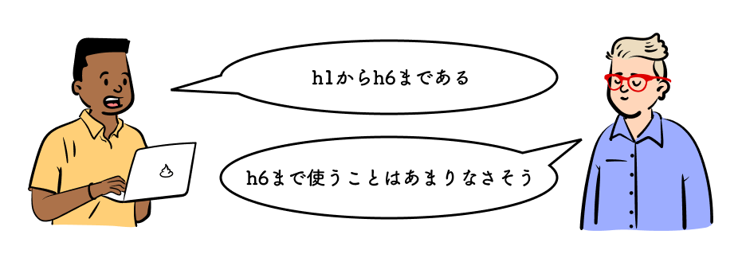
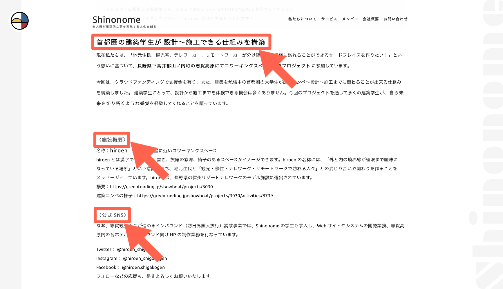
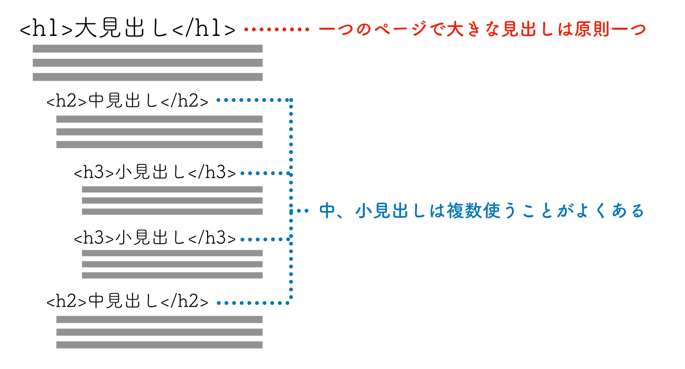
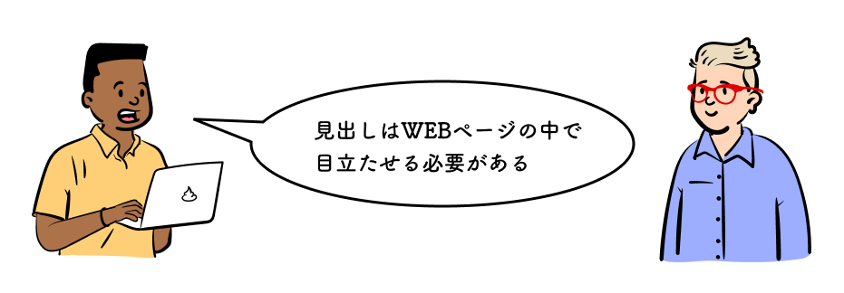

## この章で作る WEB サイトと学習内容

https://codesandbox.io/s/02-01-09-gcz05?autoresize=1&fontsize=14&hidenavigation=1&view=preview

上記の WEB サイトを作ることで、以下を学ぶ。

- 見出しとは
- 枠や背景のスタイルの当て方
- 前後に記号を付け足すスタイルの当て方
- 立体感を出すスタイルの当て方

## 学習環境を用意する

CodeSandbox 右下の`Open Sandbox`をクリックして編集ページを開こう。

https://codesandbox.io/s/02-01-01-reu2w?autoresize=1&fontsize=14&hidenavigation=1&view=split

## 見出しとは

> 文章構成の話をしよう

本格的に HTML を書く前にアレンは言った。

見出しとは文章の段落の初めに書き、文章の内容を分かりやすくする文のことだ。下の WEB サイト例の赤枠が見出しである。見出しはその後の文章を一言で示している大事な文であることが多い。



実際に書いてみよう。下記のコードを`<h1>`の後に書き加える。

```html
<h2>h2</h2>
<h3>h3</h3>
<h4>h4</h4>
<h5>h5</h5>
<h6>h6</h6>
```

書き加えると以下のようになる。

https://codesandbox.io/s/02-01-02-dinuw?autoresize=1&fontsize=14&hidenavigation=1&view=split

HTML で見出しを書くときは`<h1>`など`<h数字>`の Tag を使う。数字は`<h6>`まである。  
`<h1>`が大見出し、`<h2>`が中見出し、`<h3>`が小見出しになり、`<h6>`まで数字が大きくなるにつれて見出しの大きさが小さくなっていく。  
アレンはそう言うと、下の図を見せた。



ニュースの記事を想像してみて欲しい。`<h1>`はいわゆる記事のタイトルである。`<h2>`以降はニュースの中で話が変わる際に文の頭に挿入される段落のタイトルなどにあたる。見出しは文章をわかりやすくするために重要な役割を持っている。



見出しはその後に続く文章を的確に表す重要な言葉が書いてあるので WEB ページの中で重要な役割を果たすことが多い。そのため、数ある Tag の中でも特に多くのデザインが生み出されている。[`HTML 見出し デザイン`](https://www.google.com/search?q=html+%E8%A6%8B%E5%87%BA%E3%81%97+%E3%83%87%E3%82%B6%E3%82%A4%E3%83%B3)で検索してみると非常に多くのデザインがあることがわかる。今回は CSS でできる基本的なことを学ぼう。

次のページに進もう。
