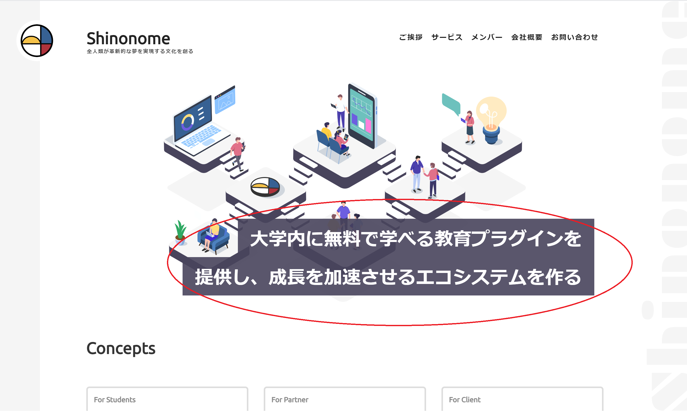

## はじめに

このページでは、「立体感を出す２」をする上で前提として知っておくべき事柄について記述する。

これは、 [株式会社 Shinonome](https://shinonome.io/) のホームページである。




1 つ目はアイコンが外に飛び出たデザインであり、2 つ目は写真の上に文字を重ねることで表示がされているのがわかる。

写真や図形の上に文字を重ねるには、`position`というプロパティを使う必要がある。

position にはいくつかの値を指定することができるが、その中でもとくに`relative`と`absolute`が用いられるので、その 2 つについて説明する。

### relative

主な使用方法

①. absolute と一緒に使用し、absolute を指定する要素の基準となる部分に使う。

②. 通常表示されている場所からどれだけ離れた位置に存在しているかという書き方で表記したいときに使う。

### absolute

主な使用方法

❶. position に初期値（static）以外が指定された親要素を基準にして、どれだけ離れた位置に存在しているかという書き方で表記したいときに使う。

また、移動量を表現するためには、以下の 4 つのプロパティが用いられる。

### top, left, bottom, right

それぞれ基準となる場所の上、左、下、右から測ってどれだけ離すのかを示す。
例えば、`top: 50px;`と書けば、基準となる場所から 50px 離れた位置に存在するという意味である。

ここからは、relative と absolute を使った実装方法について比較検討してみる。

## 1. position: absolute; で移動させる方法

使用方法の ① と ❶ を用いた方法である。

この方法はかなり使用するため、まずこの方法を覚えよう。

ここでは、ホームページのように、右下に文字を反映させる方法について説明する。

https://codesandbox.io/s/position-1-1xkq3?autoresize=1&fontsize=14&hidenavigation=1&view=preview

## 1.1. これまでのプロパティの復習

まず、color や background-color を使って下のように css を書く。

ここでは、

```
div {
  width: 800px;
  height: 400px;
  background-color: #e09914;
}

h1 {
  margin: 0;
  background-color: #2b2bb4;
  color: #ffffff;
}
```

とした。
このとき、下のようなデザインができる。

https://codesandbox.io/s/position-2-3ymtv?autoresize=1&fontsize=14&hidenavigation=1&view=split

## 1.2. 基準位置を指定

absolute の説明に「position に初期値（static）以外が指定された親要素を基準」とあるが、relative の説明に「absolute を指定する要素の基準」とあるように、relative を用いることが多い。

今回、オレンジ色の四角形を基準にして、青色の四角形を移動させたいので、基準となるオレンジ色の方に`position: relative;`を追加してみる。

https://codesandbox.io/s/position-3-ohtt8?autoresize=1&fontsize=14&hidenavigation=1&view=split

## 1.3. 移動させる方の css を追加

今回は青色の四角形を移動させたいので、青色の四角形に`position: absolute;`を指定する。

そして、基準（オレンジ色）の四角形からみたとき、下から 8px, 右から 16px 離れた位置に配置したい。
そこで、青色の四角形に`bottom: 8px; right: 16px;`を追加してみる。

横にスクロールして確認して欲しい。

https://codesandbox.io/s/position-1-1xkq3?autoresize=1&fontsize=14&hidenavigation=1&view=split

そうすると、お手本のように移動させることができた。

## 2. position: relative; で移動させる方法

使用方法の ② を用いた方法である。
次に、下のような見た目を作っていく。

https://codesandbox.io/s/position-4-3bd9h?autoresize=1&fontsize=14&hidenavigation=1&view=preview

色や大きさの指定は、1.1 で記述したものと同じである。

本来存在する場所は半透明になっている場所であるため、その位置を基準に上から 16px、左から 32px 移動させた場所に移動させたい。


移動させたいのは青い四角形の方なので、`h1`に`position: relative;`を指定し、どれだけ移動させるのかを記述するために、`top: 16px; left: 32px;` とした。

https://codesandbox.io/s/position-4-3bd9h?autoresize=1&fontsize=14&hidenavigation=1&view=split

そうすると、お手本のような見た目を作成することができた。

移動させるときは、top と left、bottom と right のように、上下のどちらかと左右のどちらかを用いる。

また、移動させない場合でも、例えば`top: 0;`のように指定しておくと、わかりやすい。

次ページでは、position の発展的な利用方法について記述する。

::: div column

##　注意

- position を使うことで比較的自由に表示位置を移動させることができるが、スマートフォンで見たり、他人が見たりするとデザインが崩れていることがよくあり、よく注意して使用する必要がある。
- とくに、移動させる量が大きい時はデザインが崩れがちである。
- 今回紹介した写真や図形の上に文字などを重ねる場合や、次のページで紹介する図形を作成するときなど、position を使わなければ作成が困難な場合にのみ使用しよう。
  :::
