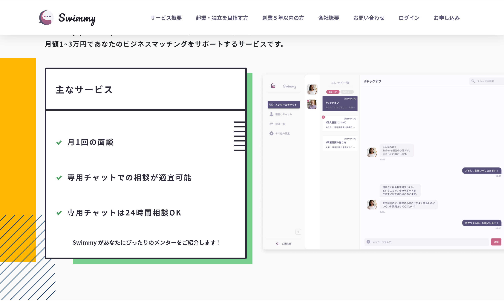

このページでは、position を用いて重なりの順番を指定する方法について説明する。

下の写真は「Swimmy」という、Playground のメンバーが実際に案件で作成したホームページである。

よく見ると、左下の方は説明文といくつかの図形が重ねられてできていることがわかる。

このサイトに限らず、重ねる順番が間違っていると見た目が大きく変わり、場合によっては文字を覆ってしまうようなことが発生してしまう。

例えば、下の図を見て欲しい。先ほど使用した`relative`、`absolute`を使用して正方形を表示してみた。

https://codesandbox.io/s/z-index-2-klic6?autoresize=1&fontsize=14&hidenavigation=1&view=split

このとき、画面の手前から奥向きにみた場合、青 → 緑 → 赤色の順番で表示がされており、文字の一部が見えなくなっている。

緑色の正方形を一番手前に表示させるには、`z-index`というプロパティを使用する。

### z-index

特定の条件を満たした状態（コラムの注意書きを参照）で使うことができ、数字が大きくなるほどより手前に表示させられる

そこで、緑の正方形に対し、`z-index: 1;` を指定した。

https://codesandbox.io/s/z-index-1-nrzfq?autoresize=1&fontsize=14&hidenavigation=1&view=split

このようにすることで、期待通り緑色の正方形を一番手前に表示させることができた。

::: div column

## コラム

###　注意

- `z-index`を多用すると振舞いの理解や予測がしづらくなるため、使用しなくても影響がない場合は使用しない。原則として、html ファイルの下に書いたタグが一番手前に表示されることを意識する。

- `z-index`は整数で指定する必要がある。

- 厳密には負の整数も指定できるが、正の整数で指定することが一般的である。

- `z-index`の効果がある条件はいくつかあるため、参考記事として取り上げておく。しかし、このコース課題では取り上げられていないプロパティも多くあるため、現段階では`position`に`relative`や`absolute`が指定されたときに使用できると覚えておくと良い。

### 参考記事

[MDN z-index が使用できる条件](https://developer.mozilla.org/ja/docs/Web/CSS/CSS_Positioning/Understanding_z_index/The_stacking_context)
:::
