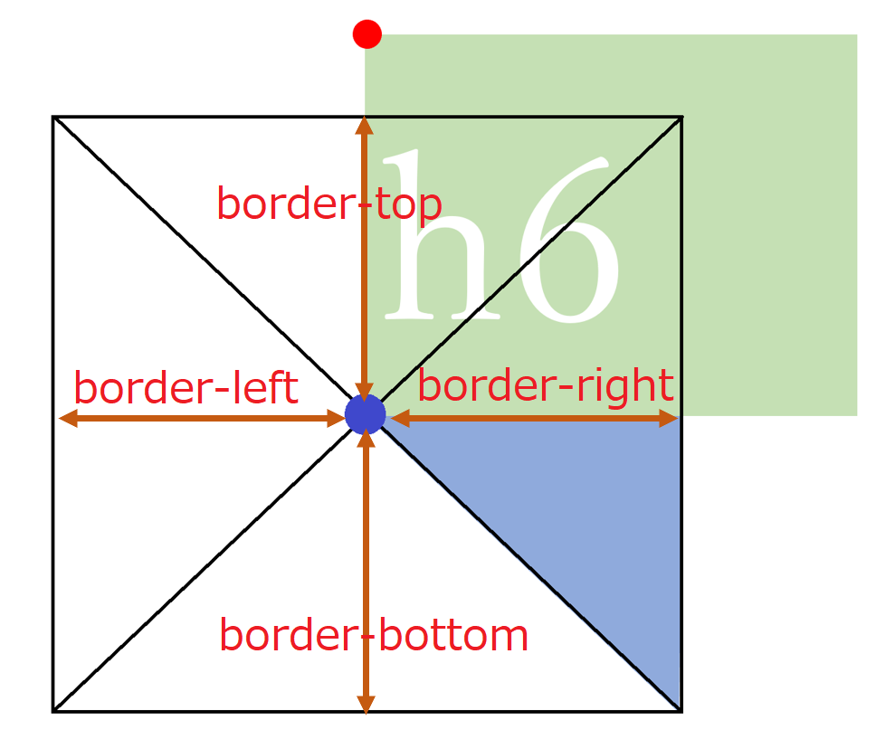

## リボンの作り方

最後にリボンのようなスタイルを作ってみよう。
<br>このページは「立体感を出す１」の続きであり、`position`の応用的な利用方法について紹介する。
<br>44 行目の`}`の下の行に以下を書き加えよう。

```css
h6 {
  margin: 20px;
  padding: 5px;
  position: relative;
  background: rgb(155, 207, 190);
  color: white;
}
h6::before {
  position: absolute;
  content: "";
  top: 100%;
  left: 0;
  border-bottom: solid 10px transparent;
  border-right: solid 15px rgb(149, 158, 155);
}
```

書き加えると以下のようになる。

https://codesandbox.io/s/02-01-09-gcz05?autoresize=1&fontsize=14&hidenavigation=1&view=split

リボンの折り込んだ部分は次の仕組みで表示されている。

::: div shadow

:::

1.

```
h6 {
  position: relative;
}
```

で赤点を座標の基準にする

2.

```
h6::before {
  content: "";
  position: absolute;
  top: 100%;
  left: 0;
}
```

で大きさのない要素を青点に作成

3.この状態で border を指定すると図に示しているように枠が直線ではなく三角形になる。

```
h6::before {
  border-bottom: solid 10px transparent;
  border-right: solid 15px rgb(149, 158, 155);
}
```

を指定することで右側(border-right)に深緑の三角形、下側(border-bottom)に透明（transparent）の三角形が表示される。
<br>下側の三角形は上下方向の高さを指定するのに必要。

次のページに進もう。
