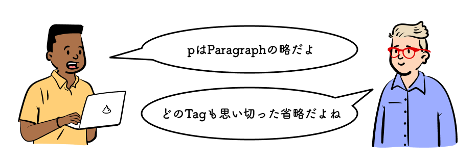

## この章で作る WEB サイトと学習内容

https://codesandbox.io/s/02-02-04-uuxtr?autoresize=1&fontsize=14&hidenavigation=1&view=preview

上記の WEB サイトを作ることで、以下を学ぶ。

- 段落とは
- フォントと行の高さの変更
- フォントの大きさと太さの変更
- ルビをふる

## 学習環境を用意する

CodeSandbox 右下の`Open Sandbox`をクリックして編集ページを開こう。

https://codesandbox.io/s/02-02-01-0lutw?autoresize=1&fontsize=14&hidenavigation=1&view=split

## 段落とは

段落とは文章のひとかたまりを表す。HTML において`<p>`で囲まれた文章は 1 つの段落であることを示す。例えば以下のような例文があるとする。

**お暑うございますが、あれからいかがお過ごしでしょうか。**

**この度は、私の思いもよらない怪我に際して、お見舞いにお越しいただいたばかりかお見舞いの品までいただき、厚くお礼申し上げます。  
お陰様で、近日中に仕事へ復帰することになりました。**

この場合 1 行目と 3 行目以降のように 1 行空いている文章のかたまりが段落になる。最終行は改行されているが段落ではない。よって HTML では次のように記述する。

```css
<p>お暑うございますが、あれからいかがお過ごしでしょうか。</p>

<p>
  この度は、私の思いもよらない怪我に際して、
  お見舞いにお越しいただいたばかりかお見舞いの品までいただき、
  厚くお礼申し上げます。<br />
  お陰様で、近日中に仕事へ復帰することになりました。
</p>
```

HTML で文章を書く時に一番基本となるタグである。

次のページに進もう。
