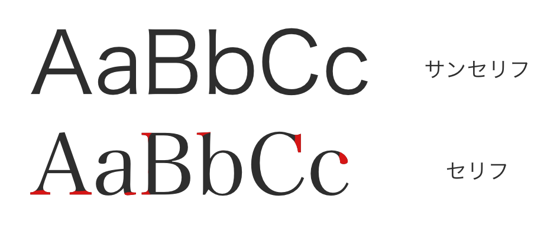

## フォントと行の高さの変更

文章を書く時に一番はじめに気になるのは書いた文字が見やすいかどうかだ。

> 汚い文字よりもきれいな文字の方が読みやすい

WEB サイトでも同様のことが言える。より読みやすい文字のサイトの方が訪れたユーザーにとっていいことは明らかだ。また、行と行の隙間がある程度空いていた方が見やすいのも確かだ。そこで見やすい文字で表示されるようにフォントの指定を行い、行間を空けるために行の高さを指定する。

下記を 10 行目の下の行に書き加えよう。

```css
<style>
  p {
    font-family: "游ゴシック体", "Yu Gothic", YuGothic, sans-serif;
    line-height: 2rem;
  }
</style>
```

書き加えると以下のようにフォントが変わり、行間が空いた。

https://codesandbox.io/s/02-02-02-ipsfj?autoresize=1&fontsize=14&hidenavigation=1&view=split

::: div c2
::: div lc

:::
::: div rc
フォントには種類がある。{San Serif}^(サンセリフ)と{Serif}^(セリフ)だ。飾りのない文字をサンセリフと呼び、文字の端に小さな飾りのある文字をセリフと呼ぶ。一般的にセリフは格調高く見えることもあり、書籍や公文書などで用いられる。
:::
:::

`font-family`プロパティはフォントを指定するプロパティだ。今回は 1 つのフォントを指定した。游ゴシックとサンセリフだ。WEB サイトは様々な PC で表示されるためそれぞれの PC にフォントが必ずインストールされているとは限らない。そこで游ゴシック → サンセリフのように優先順位をつけて指定し、游ゴシックがインストールされていない PC でもサンセリフで文章が表示されるように指定した。また、PC ごとにフォントの呼び方が変わっていたりする。そこで`"游ゴシック体", "Yu Gothic", YuGothic,`と指定することで游ゴシックのインストールされているどの PC でも游ゴシックが表示されるようにした

`line-height`プロパティは行の高さを指定する。大きさの指定の単位は絶対値である`px`の他相対値である`%`や`rem`がある。`%`は親要素との相対値、`rem`はルート要素（`<html>`）との相対値になる。今回は`2rem`を指定しているので表示されている文字の 2 倍の大きさで行の高さを指定していることになる。

次のページに進もう。
