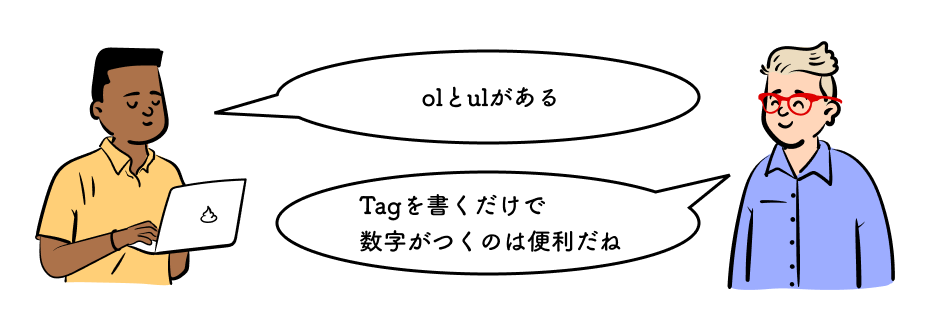

## この章で作る WEB サイトと学習内容

https://codesandbox.io/s/02-03-03-r7d0n?autoresize=1&fontsize=14&hidenavigation=1&view=preview

上記の WEB サイトを作ることで、以下を学ぶ。

- 箇条書きとは
- 箇条書きの行頭記号を変える
- 箇条書きを横に並べる

## 学習環境を用意する

CodeSandbox 右下の`Open Sandbox`をクリックして編集ページを開こう。

https://codesandbox.io/s/02-03-01-pts6f?autoresize=1&fontsize=14&hidenavigation=1&view=split

## 箇条書きとは

項目を順序づけたり並べて書くことを箇条書きという。HTML では順序なしの箇条書きと順序付きの箇条書きは書き方が異なる。

順序なしの箇条書きは`<ul>`と`<li>`を使用して書く。

```html
<ul>
  <li>項目1</li>
  <li>項目2</li>
</ul>
```

順序付きの箇条書きは`<ol>`と`<li>`を使用して書く。

```html
<ol>
  <li>項目1</li>
  <li>項目2</li>
</ol>
```

## 箇条書きの行頭記号を変える

10 行目の下に以下を書き加えよう。

```css
<style>
  ul {
    list-style-type: circle;
  }
</style>
```

書き加えると以下のように箇条書きの行頭文字が変わる。

https://codesandbox.io/s/02-03-02-1zyot?autoresize=1&fontsize=14&hidenavigation=1&view=split

`list-style-type`プロパティは箇条書きの行頭記号を指定するプロパティである。初期値は`disc`である。`css list-style-type`で検索すると指定できる行頭記号がわかる。

::: div column

##　コラム

### 参考（現在は非推奨の方法なので覚えなくて良いです）

デザインの関係上、箇条書きの項目を横並びにして表示したい時がある。`<style>`内のコードを以下に書き換える。

```css
ul {
  list-style-type: none;
  padding: 0px;
}
li {
  margin-right: 10px;
  float: left;
}
```

下記のように横並びで表示される。

https://codesandbox.io/s/02-03-03-r7d0n?autoresize=1&fontsize=14&hidenavigation=1&view=split

`float`は過去にはよく用いられたが、現在ではあまり使われていない。
<br> 代わりに、後で紹介する「flexbox」を用いて実装することが多いので、過去にはこういう実装があったという程度で良い。
<br> なぜ使われなくなったかは、「float 使わない」「float 回り込み」などで調べてみると良い。

:::

## 参考文献

### 検索フレーズ

[`css list-style-type`](https://www.google.com/search?q=css+list-style-type)
