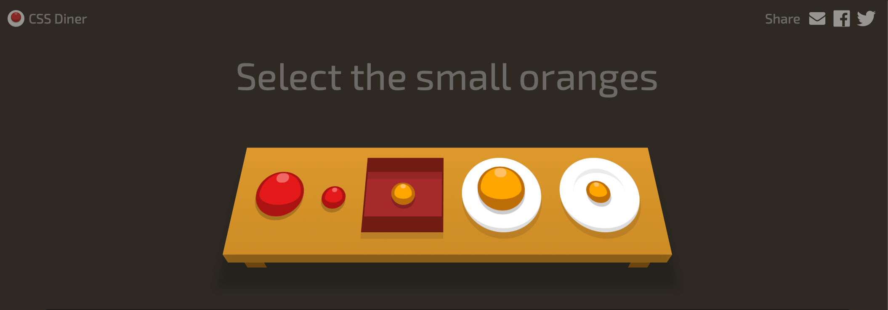

前のページで css を当てるには、タグの他に`id`や`class`の属性を使うことを学んだと思う。  
しかし、もっと細かく指定する必要が開発をする上で出てくる。  
今回は [CSS Diner](https://flukeout.github.io/)という外部サービスを用いて、様々な CSS のセレクタを学ぼう。

::: div column
全問正解するまで取り組もう！  
全問正解したら、Study Diary に感想を書いてみてください。
:::
