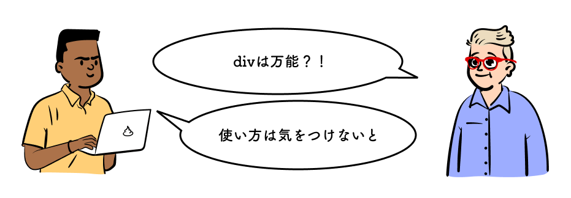

## この章で作る WEB サイトと学習内容

https://codesandbox.io/s/02-06-04-rudzi?autoresize=1&fontsize=14&hidenavigation=1&view=preview

上記の WEB サイトを作ることで、以下を学ぶ。

- レイアウトを表すタグ
- {Div}^(ディブ)

## 学習環境を用意する

CodeSandbox 右下の`Open Sandbox`をクリックして編集ページを開こう。

https://codesandbox.io/s/02-06-01-vypq0?autoresize=1&fontsize=14&hidenavigation=1&view=split

## レイアウトを表すタグ

用意したテンプレートは文書としては既に完成している。しかし、WEB サイトとして見せ方を考えた時画面に常に表示される部分を作ったり、ある節だけデザインを変えて強調したいなどいくつかのタグを括ってスタイルを当てたい状況が出てくる。

::: div c2
::: div lc

:::
::: div rc
WEB サイトの多くはこのような作りになっている。HTML ではそれぞれの部品にタグを用意している。このタグを使用することが推奨されている。
:::
:::

今回の文書に合わせて以下のようにそれぞれを追加した。

https://codesandbox.io/s/02-06-02-jwdp5?autoresize=1&fontsize=14&hidenavigation=1&view=split

この状態ではタグにスタイルが当たっていないため見た目上は何も変わらない（Span の時と一緒）

## Header を上部に固定する

上部に情報を常に表示するために以下を`<style>`に書き加える。

```css
header {
  inline-size: 100%;
  position: fixed;
  top: 0px;
  background-color: rgba(255, 255, 255);
  border-bottom: 1px solid rgb(100, 100, 100);
}
```

書き加えると以下のようになる。`<header>`に囲われた部分が常に上部に固定されて表示されるようになる。

https://codesandbox.io/s/02-06-03-uk0dv?autoresize=1&fontsize=14&hidenavigation=1&view=split

`position`プロパティを`fixed`にすることで画面上に固定することができる。`top: 0px;`をしていすることで画面の位置を指定できる。

## Div

`<header>`や`<main>`などに当てはまらない部分にスタイルを当てたい時は`<div>`を使う。`div`の役割は`span`と同じだ。



https://codesandbox.io/s/02-06-04-rudzi?autoresize=1&fontsize=14&hidenavigation=1&view=split

::: div column

## コラム

他にどんなタグがあるのか、そのタグの用途は何なのか調べよう。  
どのタグを使うのが適切か考えることを`Semantics`を考えるという。  
適切なタグを使うことによってどのようなメリット・デメリットがあるか考えて Study Diary に書いておこう。  
このセクションに関する課題はありません。
:::
