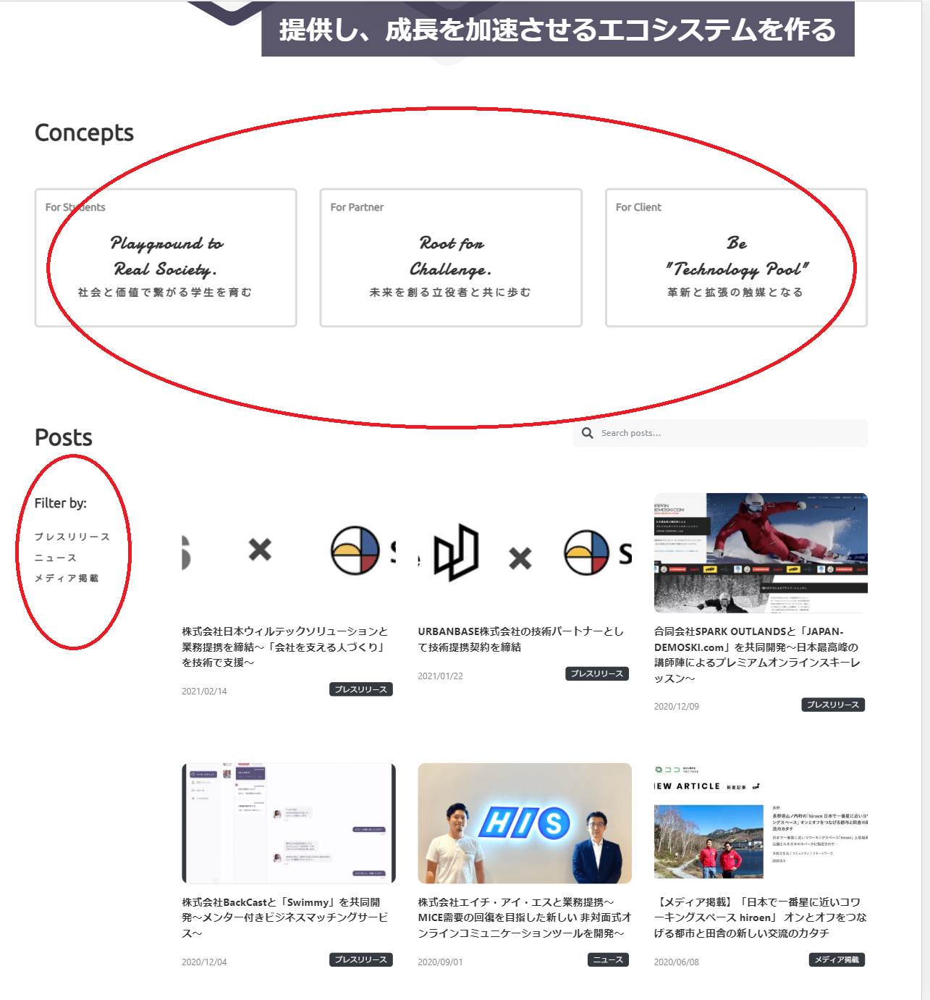

このページでは、記事やリストなど、いくつか同じ構成で作られたパーツを綺麗に並べる方法について説明する。

箇条書きを作成するページでは「float」について少し触れたが、現在の実装ではほとんど用いられていない。

その代わり、「flexbox」というものを用いて開発が進められる。

> 「flexbox」は頻繁に使う重要な概念であるため、ぜひ習得してほしい。

## 1. flexbox で表現できるレイアウトとは？

下の写真のように一列並びのデザインを手軽に作ることができる。

## 2. 必ず覚えておくべき css プロパティ

flexbox は汎用性が高く、種類も豊富なので、どこから勉強すればわからなくなってしまうことが多い。

そのため、最終課題や案件でよく使用する現段階で覚えておくべき css プロパティを 4 つに絞って説明する。

flexbox を取り扱っている記事は抽象的に書かれているものが多いが、ここではできる限り噛み砕いて解説している。

今回取り上げなかったものは参考記事としてまとめておくので、時間があるときや詰まったときに目を通しておいてほしい。

## 2.1. display: flex;

「flexbox」を使用するときに必ず宣言する決まり文句のようなもの。

## 2.2. align-items

要素が並んでいる方向と直交する方向にどの配置にするのかを設定する。

例えば横並びの場合、上揃え、下揃えなどを指定するときに使う。

例

https://codesandbox.io/s/flexbox-1-klkn8?autoresize=1&fontsize=14&hidenavigation=1&view=split

10 行目で、「flexbox を使用します」ということで`display: flex;`を指定した。

特に何か css プロパティを指定していないときは左から右に並ぶ。

アイコンとタイトルの高さが揃っていないため、上下中央揃えが可能な`align-items: center;`を指定した。

## 2.3. justify-content

どの程度詰めて並べるのかを指定する。

例

https://codesandbox.io/s/flexbox-2-vmshl?autoresize=1&fontsize=14&hidenavigation=1&view=split

flexbox とは関係ないが、ここで書いてあるように`a`タグの`href`に URL を書くと、そこに移動することができる。

10 行目で`display: flex;`を指定し、右揃えをしたかったので、`justify-content: flex-end;`を指定した
。

## 2.4. flex-direction

要素の並び順を変える。

例

https://codesandbox.io/s/flexbox-3-ccq1x?autoresize=1&fontsize=14&hidenavigation=1&view=split

写真に合ったような縦並びを表現した。

`display: flex;`を指定し、縦に並べる時は`flex-direction: column;`を指定する。

flexbox を使いこなすことで、さまざまな配置をすることが可能になる。

他にどのような値を指定できるのかは各自で調べてほしい。

::: div column

## コラム

flexbox について詳しく知りたい方は、以下もご覧ください。

- Web 教材

  - [flexbox のチートシート](https://www.webcreatorbox.com/tech/css-flexbox-cheat-sheet)

- Youtube

  - [しまぶーの IT 大学「基礎からちゃんと学ぶ CSS 入門！フレックスボックス (flexbox) の使い方をゲームで学ぼう」](https://www.youtube.com/watch?v=FU4RocY_Y1k)

  - [しまぶーの IT 大学「基礎からちゃんと学ぶ CSS 入門！ flexbox の flex プロパティの使い方を徹底解説」](https://www.youtube.com/watch?v=TXwY_SWO07U)

:::
