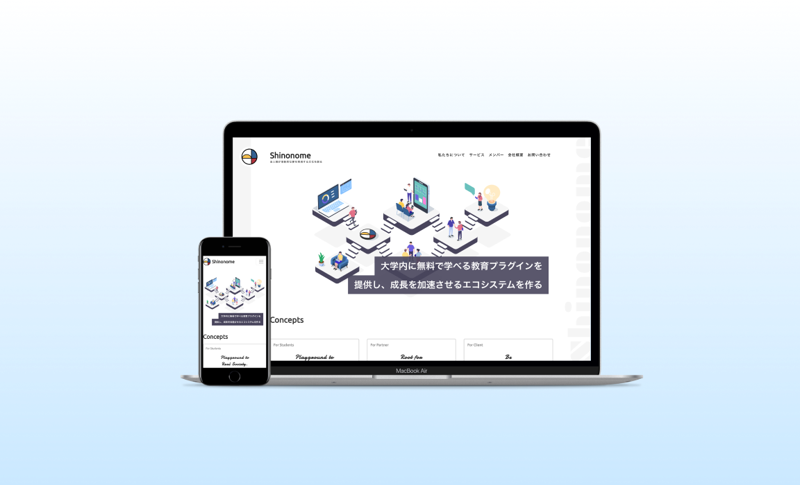

スマホが普及したことによって、PC だけでなく、タブレットやスマホで閲覧しやすいように対応するのがこの２種類の対応方法だ。  
それぞれどんなメリット・デメリットがあるのか見ていこう。

### スマホ対応

デバイスごとに専用のサイトを作ること。デバイスごとに異なる HTML ファイルを持つ。

#### メリット

- 独立した運用管理ができる
- デザインをそれぞれの環境に合わせて作ることができる

#### デメリット

- 更新するのが面倒臭い

### レスポンシブ対応

圧倒的にこっちの方が多い。CSS のメディアクエリを使い、デバイスごとに異なる CSS を適用させる。

#### メリット

- 更新がスマホ対応より楽
- Google が推奨している
- SEO や SNS のシェアが強い

#### デメリット

- ページの表示に時間がかかる場合がある
- 制作期間が膨らむ
- デバイスごとに大きくデザインは変えづらい

## 読み終わったら

::: div column
Study Diary に調べたこと、理解できたことや感想を書いてみよう。
:::
