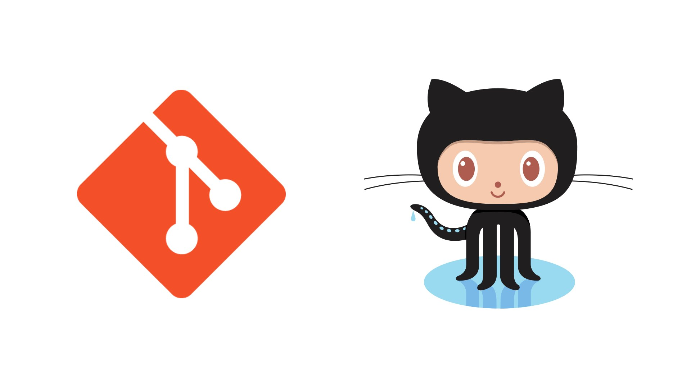

次は Git/Github を使ってチーム開発をすることの利点や使い方を学ぼう。
Play Ground 全コース共通の課題のため、この Git 課題は Google Classroom というサービスを使い学習を進める。

### Git 課題の進め方

1. [Google Classroom](https://classroom.google.com/)にアクセス
2. 右上の＋ボタンから`クラスに参加`をクリックする
3. クラスコード`oqucucs`を入力して参加する

::: div column
最後にテストがある。一通り終わったらテストを受け、満点が取れたら PGrit で講師にメンションをして Git 課題が終わったことを報告をしよう。  
次はいよいよ最終課題！！

Study Diary にも学んだこと・理解したことを忘れずに記録しておこう。

:::
