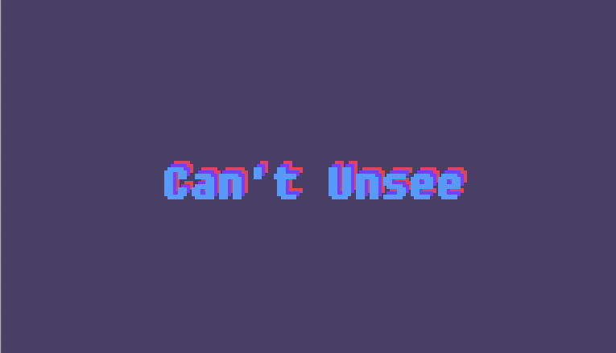

まずは、いいデザインとは何か学ぼう。  
フロントエンド で大事なのは、使う人の立場になって、このデザインは使いやすい・わかりやすいのか考えることだ。  
デザイナーが考えたデザインをそのまま実装せず、疑問を持てるようになろう。  
ここで必要なのが`UI`,`UX`という概念だ。

## UI とは

UI はユーザーインターフェイスの略。  
例えば何かの WEB サイトを PC やスマホ、タブレットで見ているとき、その画面上で見られる情報（フォントやデザイン等）すべてが UI にあたる。

## UX とは

UX はユーザーエクスペリエンスの略。

例えばあなたが、とある WEB サイトを訪問したとしよう。  
あなたはその WEB サイトを見てどのように感じるか？
例えば、

- デザインが美しい
- フォントが見やすい（読みやすい）
- なんの情報がどこにあるか分かりやすい
- ページの読み込み速度が速くて使いやすい

これらの感想が 全て UX。
商品やサービスに触れて、ユーザーが感じることすべてが UX となる。

## [Can't Unsee](https://cantunsee.space/) とは

どちらが良いデザインか簡単に何か学べるクイズ形式のサイト。  
`Tutorial`,`Easy`,`Medium`,`Hard` の 4 段階で構成されている。  
なぜそのデザインが良いのか悪いのか、解説もしっかり読もう。

::: div column
全問正解するまで取り組もう！  
全問正解したらスコアのスクリーンショットを Study Diary に載せ、感想を書いてみてください。
:::
