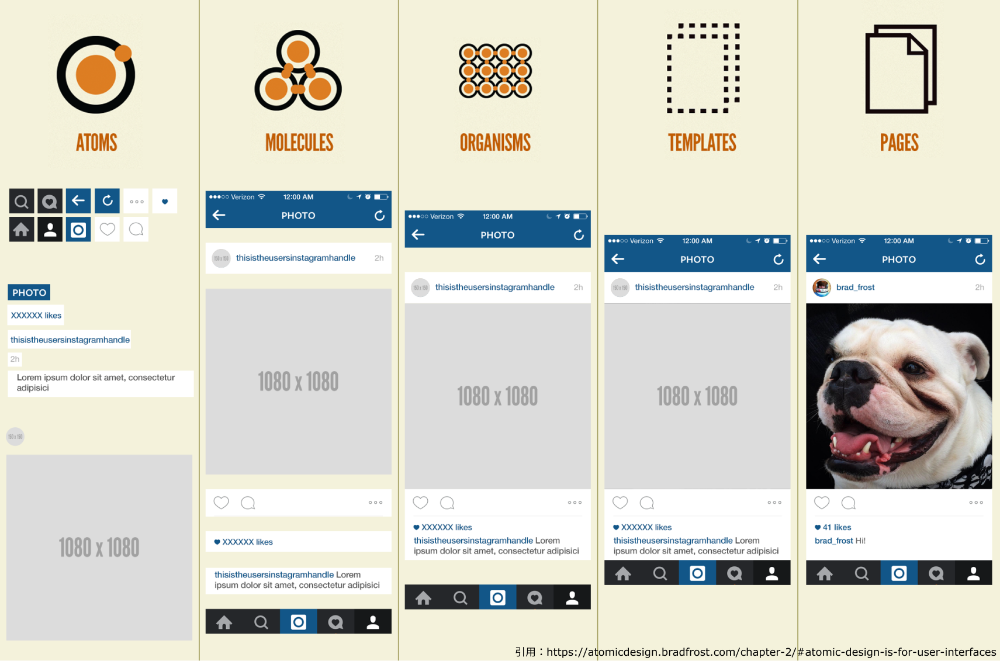

### Atomic Design とは？

Atomic Design(アトミックデザイン)とは、画面を構成する要素を、`Atoms(原子）`,`Molecules（分子）`,`Organisms(有機体）`,`Templates(テンプレート）`,`Pages(ページ）`の 5 つの階層に分け、最終的な UI と UI の基礎となるデザインシステムを同時に作成する設計方法だ。

### 利点

- 機能やコンポーネント単位で考えることで、デバイスやページの概念に縛られず、動的にデザインできること。
- それぞれの階層でコンポーネント化をすることによって修正・変更しやすく、パーツの使い回しもできる。

### 例

以下の画像が instagram を Atomic Design 化 したもの。

