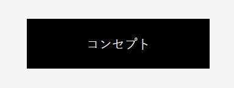
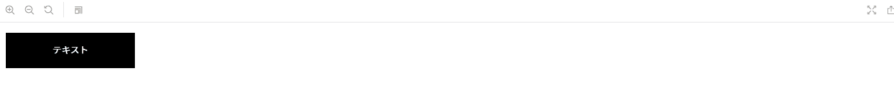
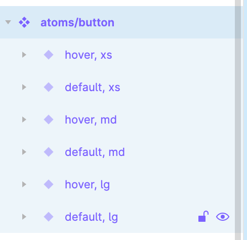
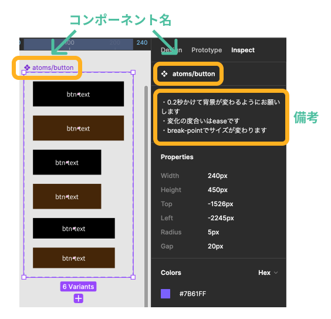
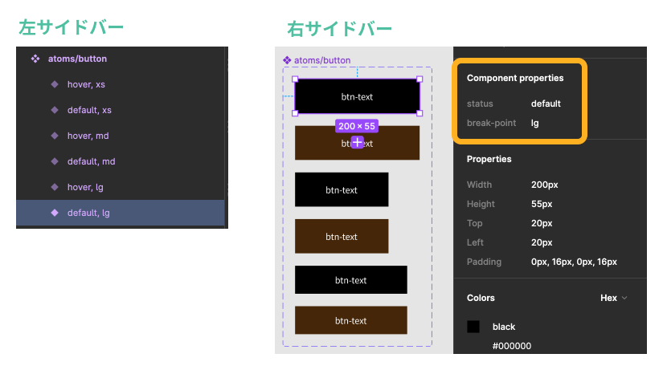
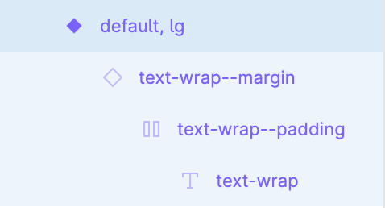
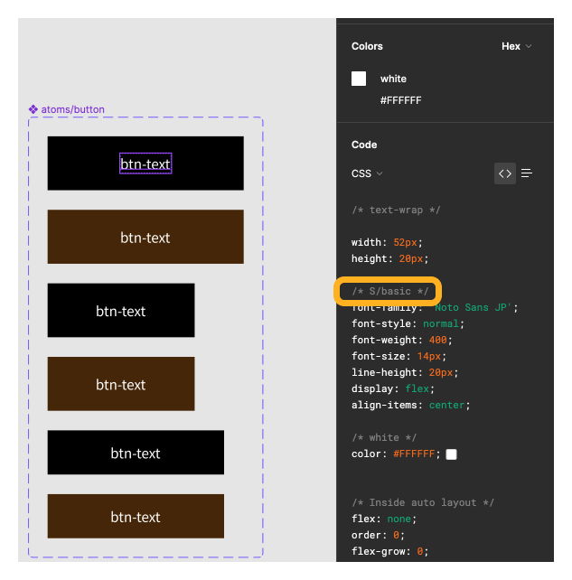

### 作るもの





figma にあるコンポーネントを参考に、storybook 上で上の動画のように動作する物を作成してください。

figma の見方はページ後半で解説しています。

### ファイル名、ディレクトリ構造

```
src
├ components
│ └ atoms
│   └ button
│     ├ button.html
│     └ button.scss
└ stories
  └ atoms-button.stories.js
```

### Figma の見方

スクリーンショットと違う表示になる場合がありますが、そのまま進めて大丈夫です。  
調べてもわからない点があれば"#frontend"のタグで質問してください。

Figma の使い方のページ: [Figma の操作について](https://www.figma.com/file/itngQHR9R5RB7xwCXAKOde/TCD-Theme?node-id=5795%3A3240)  
atoms/button のあるページ: [共通パーツ](https://www.figma.com/file/itngQHR9R5RB7xwCXAKOde/?node-id=818%3A0)

#### コンポーネントのパターンを見る

atoms/button をクリックし、右サイドバーをからInspectを選択して以下の状態を見てみましょう。

| 左サイドバーの様子                      | 該当コンポーネントと右サイドバーの様子    |
| --------------------------------------- | ----------------------------------------- |
|  |  |

コンポーネント(４つのひし形のアイコン)を選択し、右サイドバーを見てみるとコンポーネント名、備考が表示されていることがわかると思います。  
ここに載っている情報を参考に実装を進めていきます。  
また、画像下部分に`6 Variants`とあるように、6 つの状態が存在します。  
1つのパターンに注目して見てみましょう。

#### コンポーネントの様子を見る

１つのパターンに注目して見てみましょう。  
どれでも構わないのでatoms/buttonのうちの1つを選択してみてください。  

右サイドバーの様子を見てみましょう。  
枠線で囲った部分がそのパーツのプロパティを示しています。  
左サイドバーで他にどのようなプロパティがあるのか見てみると、選択中のパーツはブレークポイントlg以上で通常時のデザインであることがわかると思います。  
よってatoms/buttonはホバーアクションによって茶色に変わること、ブレークポイントによってサイズが変わることがわかりましたね。



#### コンポーネントの中身を見る

左サイドバーからコンポーネントを展開していくと以下のようになると思います。

ひし形のアイコンはインスタンスといい、コンポーネントをコピーしたものです。  
このインスタンスの内容は[Shinonome のテキスト](https://design-basic.netlify.app/web/text-color/)という部分を参照してください。
子要素一つ一つチェックしてどのようなデザインになるか想像しましょう。    
1 番子要素の`T`のアイコン(テキスト要素) text-wrap を選択し、右サイドバーを見てみましょう、Figmaが自動で生成したcssが表示されています。  
自動生成されたコードなので不要なもの、不適切な記述がされていることが多々あります。  
**自分でそのcssがどのような役割を果たしているのかきちんと確認しましょう。**  
**コピペだけでは成長しません。**  
また、枠線で囲われた部分を見てみるとS/Basicとありますね。  
これはフォントスタイルで定義したものを使っているよという記述です。  
フォントスタイルの確認は前のページで習いましたね。


### 注意点

- ページの様々な場所で使われる部品です。使い回すことを考えながら作成しましょう。
- ホバー時の挙動や、画面の幅ごとの見た目を再現しましょう。
- 画像は一例です。中のテキストを変えても見た目が崩れないように作成しましょう。
- 本課題において、a タグ等の遷移先はダミー（"#"など）で結構です。
- ボタンですがリンクの機能しか持たないため a タグで作成しましょう。
- 今回の課題では、デスクトップファーストでレスポンシブ対応を行いましょう。
