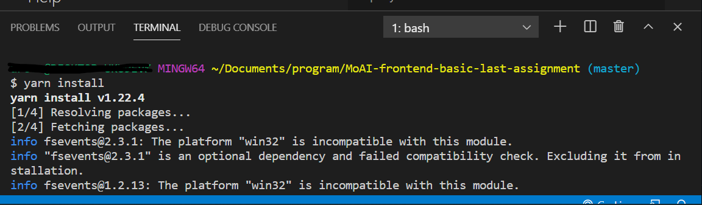

### 最終課題

実際の案件に近い形で進めていきます。
デザインを見て Atomic Design に従って実装していきましょう。

::: div column
課題を始める前に準備することが **5 つ** ありますので、忘れないようにやってください。
:::

### 課題を始める準備 1

デザインを見るツールは Figma です。 アカウント登録をしましょう。

1. [Figma オフィシャルサイト](https://www.figma.com/)にアクセスし、`Try Figma for free`からアカウント登録をしましょう。
2. メールアドレスとパスワードを入力するとアンケートが表示されるので、名前と役職を回答しましょう。これらの情報は後から変更もできます。
3. `Create Account`をクリックして、アカウントの作成は完了です。編集画面が表示され、チュートリアルが始まるので`Next`をクリックします。2 枚目でチームを作成するよう推奨されますが、個人利用の場合は必要ありませんので、左上の`Cancel`ボタンで離脱しましょう。
4. Shinonome のチームに招待をするので、`#help_center`チャンネルで Figma の登録メールアドレスを伝えて、招待してもらいましょう。
5. 招待メールが届いたら受理をして[このプロジェクト](https://www.figma.com/file/itngQHR9R5RB7xwCXAKOde/TCD-Theme)にアクセスできるか確認してください。

### 課題を始める準備 2

エディタ（コードを記述する場所）は[Visual Studio Code(略称 VSCode)](https://azure.microsoft.com/ja-jp/products/visual-studio-code/)を前提とした説明になっているので、各自の OS のものをダウンロードしてください。

### 課題を始める準備 3

Edge や Safari などのブラウザを使用している人もいると思いますが、今後の実装では [Google Chrome](https://www.google.co.jp/chrome/?brand=RPHE&gclid=CjwKCAjw1uiEBhBzEiwAO9B_HXlGrGM1aDIUSkMeDog6uHRJ_jlBmNPIR7VXQ5afuEAr5P5XiEqUmhoCV2cQAvD_BwE&gclsrc=aw.ds) を使用しますので持ってない人は各自の OS のものをダウンロードしてください。

Google Chrome はバグが少なく、レビューでも Google Chrome での見た目で採点するので必ず使用するようにしてください。

また、色や大きさは Google Chrome の検証ツールを用いて、 Figma で比較しながら作成してもらうので各自で検証ツールの使い方を調べてください。

### 課題を始める準備 4

Visual Studio Code には開発が楽になる様々な拡張機能があります。そのうち prettier は下記動画を参考にして必ず入れるようにしてください。prettier が入っていないと判断された場合レビューしないことがあります。

[しまぶーの IT 大学「Prettier の使い方解説。フロントエンドで必須のコード整形ツールで、プログラミング学習の効率も上がります。」](https://www.youtube.com/watch?v=zoaIv5ifoPI)

開発をしていて、動画のようにコードが自動で整形されない場合、各自で「prettier 効かない」などで検索してみましょう。

それ以外の拡張機能の導入は任意です。各自で調べて便利だと思う拡張機能を入れてください（拡張機能どうしが相殺されてバグの元になるので入れすぎには注意）。

### 課題を始める準備 5

1. [Node.js](https://nodejs.org/ja/)をインストールしてください。LTS と書いてある方のバージョンを選択してください。OS によってインストール手順が異なりますので、windows は[このあたり](https://qiita.com/echolimitless/items/83f8658cf855de04b9ce)、mac は[このあたり](https://qiita.com/kyosuke5_20/items/c5f68fc9d89b84c0df09)を参考に進めて、分からないことがあったら、各自で調べたり、フロントエンドコースの issue を見て同じような質問がないか探したりし、それでもわからない場合は issue を立てて質問してください。最終的にはターミナルに`node -v`と入力・実行して node のバージョンを表す数字が表示されれば成功です。
2. 次に[yarn](https://yarnpkg.com/getting-started/install)をインストールしてください。ターミナルから`npm install -g yarn`を実行することでインストールできます。`yarn -v`を実行してバージョンが表示されたら成功です。
3. [最終課題テンプレートリポジトリ](https://github.com/shinonome-inc/frontend-basic-last-assignment-2021)を開き、"Use this template"から最終課題用のリポジトリを作成してください。**リポジトリの名前は`<あなたのslack名など他の人と被らない名前>-frontend-basic-last-assignment`としてください。**
   
   
4. Chromatic というサービスの設定をします。[公式サイト](https://www.chromatic.com/)にアクセスして、"Get started now"から Github アカウントと連携してログインしてください。
   
   

5. ログインができたらホーム画面の"Add project" > "Choose from Github" と進み、"ADD PROJECT"から先ほど作成したリポジトリを選択しましょう。
   
   
   
6. 次の画面が表示されたら、画面下部にある"--project-token="の値をコピーしましょう。
   
7. github のリポジトリページに戻り、.github/workflows/chromatic.yml ファイルを開きます。画面右側にあるペンマークから編集モードに移動してください。
   
   
8. ファイルの 22 行目にある projectToken の値が XXXXXXXX になっているので、先ほどコピーした chromatic の--project-token の値に置き換え、画面右上の Start commit > Commit changes で保存します。
   
9. 自分のリポジトリを PC にクローンします。ターミナルでプロジェクトフォルダを置きたい場所へ移動し、`git clone <リポジトリのURL>`を入力、実行します。リポジトリの URL は github リポジトリページの Code ボタンから取得できます。
   
   
10. VSCode から`Open Folder`でクローンしたプロジェクトフォルダを開いてください。
    
11. VSCode の Terminal > New Terminal でターミナルを開き、`yarn install`と入力・実行してください。今回の課題で必要な Node.js モジュールがインストールされます。
    
    

これで準備は完了です。

### 課題の進め方

Atomic Design に沿ってお手本のページの部品を分割し、それぞれに対し要件をまとめたページが用意されています。

1. まず、git で master ブランチから`<部品の種別(atoms,molecules等)>-<部品名>`という名前で新しくブランチを切ってください。
2. `src/components/<部品の種別>/<部品名>/`ディレクトリに`<部品名>.html`と`<部品名>.scss`、`src/stories/`ディレクトリに`<部品の種別>-<部品名>.stories.js`の合計 3 つのファイルを作成してください。最初から含まれている example コンポーネントの配置を参考にしてください。
3. 次項の「Storybook の使い方、Sass について」の通りに storybook を活用して課題の部品を作成してください。
4. 部品が完成したら異常がないこと、不要なコードを書いていないことなどを再度確認して、変更をコミット、リモートへプッシュし、github のリポジトリページからプルリクエストを作成してください。"Compare & pull request"を押し、セルフチェックの項目を確認したら"[]"を"[o]"に書き換えプルリクエストのタイトルを適当なものに設定します。
   
   
5. 画面を少し下にスクロールするとコミットの一覧があるので、一番最新のものの右側に表示されている黄色い丸をクリックします。出てきたポップアップの一番下の Details のリンク先 URL をコピーし、先ほどのセルフチェックの下にある"\[chromatic\]()"の丸括弧の中に貼り付けたら、"Create pull request"でプルリクエストを出します。
   
6. PGrit に、プルリクエストのリンク、「レビューお願いします」的な一言、\#frontend_review タグの三つをまとめて投稿（トゥート）してください。
7. レビュワーからレビューが帰ってきたら指摘された箇所を修正し、コミット・プッシュをしたら PGrit に同様の投稿をしてください。
8. 一次レビュワー、二次レビュワーそれぞれ一人から LGTM（合格みたいな意味）をもらったらプルリクエストをマージしてください。（二次レビュワーがマージする場合もあります。）
9. マージしたらブランチは削除してしまってください。（マージすると プルリクエスト内に Delete Branch というボタンが出ると思います。）

上記の手順で各部品を作成していってください。  
レビュワーは一次、二次ともに数人おり、毎週月曜日に交代しています。修正したプルリクエストを別のレビュワーが担当する場合もあるので、修正時も毎回\#frontend_review のタグをつけて投稿してください。  
一次レビューに合格した後に二次レビューで修正を求められた場合、修正後のレビュー依頼は週が変わった場合でもレビューしてくれた二次レビュワーをメンションして投稿するようにしてください。（もう一度一次レビューからやりなおす必要はありません。）

基本的にページの並び順に作成していただきますが、レビューを待っている間はどんどん別の部品の作成に取り組んでいただいて構いません。  
複数の作業をするときも master ブランチにいることを確認して新しくブランチを切ってください。(なんでそうする必要があるかは考えてみてね)

### レビューの基準

前提として、デザインが figma 通りになっている必要があります。そのうえで、

- html タグを適切に使えているか
- シンプルに書けているか
- 不要な記述はないか
- 中のテキストが変わった際も問題なく動作するか

等の観点から判断します。
そのコンポーネントが別のコンポーネントや page 内でどのように使われているかまで意識して実装するようにしましょう。

### 役立ち資料

課題ページに書くほどでもないけど読んでおいて損はない情報に関しては、PGWiki 内[フロントエンドコース活動記録](https://playground.wraptas.site/6162583de32e431c81fa9814b077b98b)の役立ち資料の項に追加していく予定です。  
お気に入りに登録して、気が向いたら覗くようにしてみてください。

### 補足 npm

npm(node package manager)とは、Node.js のモジュールを管理するツールです。Node.js のモジュールにはコードの成型や今回使用したコンパイラ、サーバー構築フレームワーク等様々なモジュールが開発されており、私たちは npm を介してそれらをインストールし開発を効率的に進めることができます。関連する重要なファイルとして package.json があります。この中にはプロジェクトで使用しているモジュールとそのバージョンや、簡易的なコマンドの定義等が記録されており、このファイルを git を用いてチームで共有していれば、全員が同じ環境で開発を進めることができます。

今回使用したのは npm ではなく yarn という、npm をより高速に動作させ、かつモジュール同士の依存関係という npm では結構厄介な問題を解決してくれるツールを使用しました。（必ず解決できるとは限りません）
