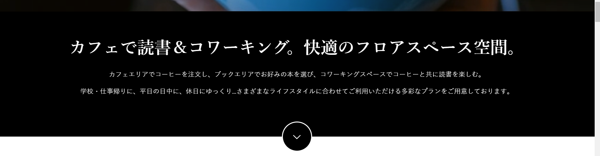
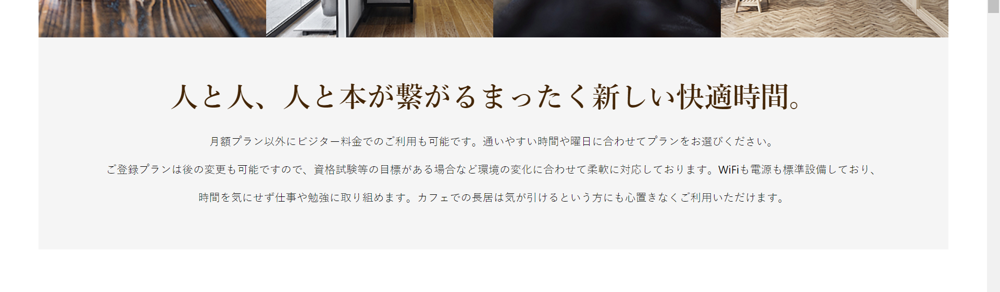

### 作るもの





### ファイル名、ディレクトリ構造

```
src
├ components
│ └ molecules
│   └ message
│     ├ message.html
│     └ message.scss
└ stories
  └ molecules-message.stories.js
```

### コンポーネントのあるページ

[共通パーツ](https://www.figma.com/file/itngQHR9R5RB7xwCXAKOde/?node-id=818%3A0)

### 注意点

- 色は場所によって変えることを想定して作成しましょう。ここでは色を指定せず１種類だけ作成しましょう。
- フォントは指定した２種類の中から適切な物を選んで使いましょう。
- 各画面幅での表示も確認しましょう。
