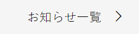

### 作るもの



### ファイル名、ディレクトリ構造

```
src
├ components
│ └ molecules
│   └ news-and-events-more
│     ├ news-and-events-more.html
│     └ news-and-events-more.scss
└ stories
  └ molecules-news-and-events-more.stories.js
```

### コンポーネントのあるページ

[news&events](https://www.figma.com/file/itngQHR9R5RB7xwCXAKOde/?node-id=820%3A0)

### 注意点

- 右向き矢印のようなアイコンは導入した fontawesome を利用しましょう。[ホームページ](https://fontawesome.com/icons?d=gallery)から似たようなアイコンを探してください。
- ホバー時の挙動も再現しましょう。
