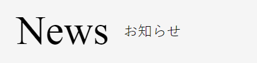

### 作るもの



### ファイル名、ディレクトリ構造

```
src
├ components
│ └ molecules
│   └ news-and-events-title
│     ├ news-and-events-title.html
│     └ news-and-events-title.scss
└ stories
  └ molecules-news-and-events-title.stories.js
```

### コンポーネントのあるページ

[news&events](https://www.figma.com/file/itngQHR9R5RB7xwCXAKOde/?node-id=820%3A0)

### 注意点

- フォントは指定した２種類の中から適切な物を選んで使いましょう。
- 見出しであることをタグで表しましょう。
- 文字の縦位置に注意しましょう。
