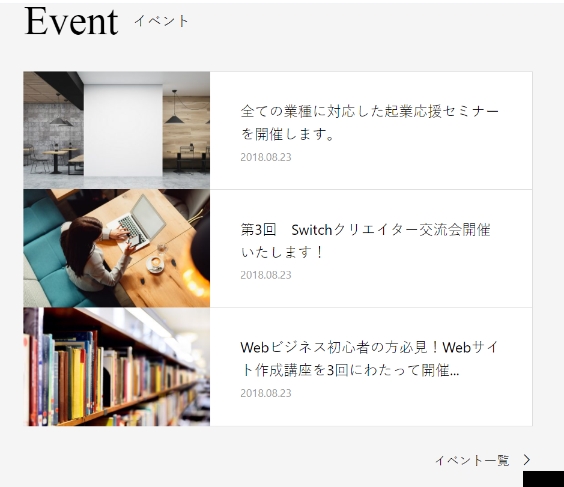

### 作るもの



### ファイル名、ディレクトリ構造

```
src
├ components
│ └ organisms
│   └ events
│     ├ events.html
│     └ events.scss
└ stories
  └ organisms-events.stories.js
```

### コンポーネントのあるページ

[news&events](https://www.figma.com/file/itngQHR9R5RB7xwCXAKOde/?node-id=820%3A0)

### 注意点

- news との共通部分は実装も同じにしましょう。
- ホバー時の挙動を再現しましょう。どこにマウスカーソルを当てたら見た目が変わるか注意してください。
