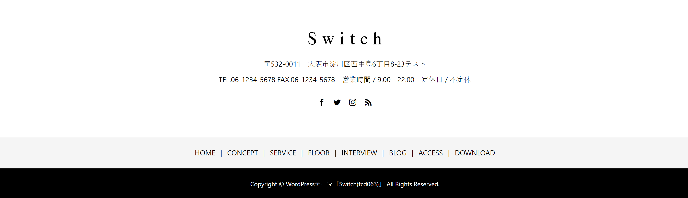

### 作るもの



### ファイル名、ディレクトリ構造

```
src
├ components
│ └ organisms
│   └ footer
│     ├ footer.html
│     └ footer.scss
└ stories
  └ organisms-footer.stories.js
```

### コンポーネントのあるページ

[footer](https://www.figma.com/file/itngQHR9R5RB7xwCXAKOde/?node-id=869%3A0)

### 注意点

- 最後のパーツです！がんばりましょう！
- SNS と RSS のアイコンは、[fontawesome](https://fontawesome.com/icons?d=gallery) を使って実装しましょう。storybook の preview では自動でアイコンをロードする設定をしているので、kit を作成する必要はありません。アイコンを検索してそのままコピペするだけで使えます。
