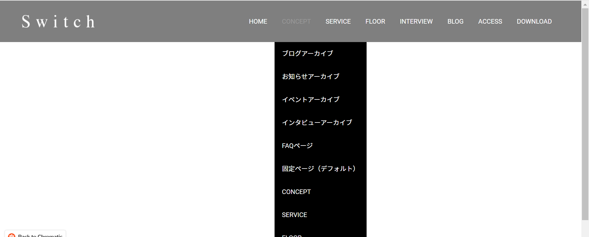
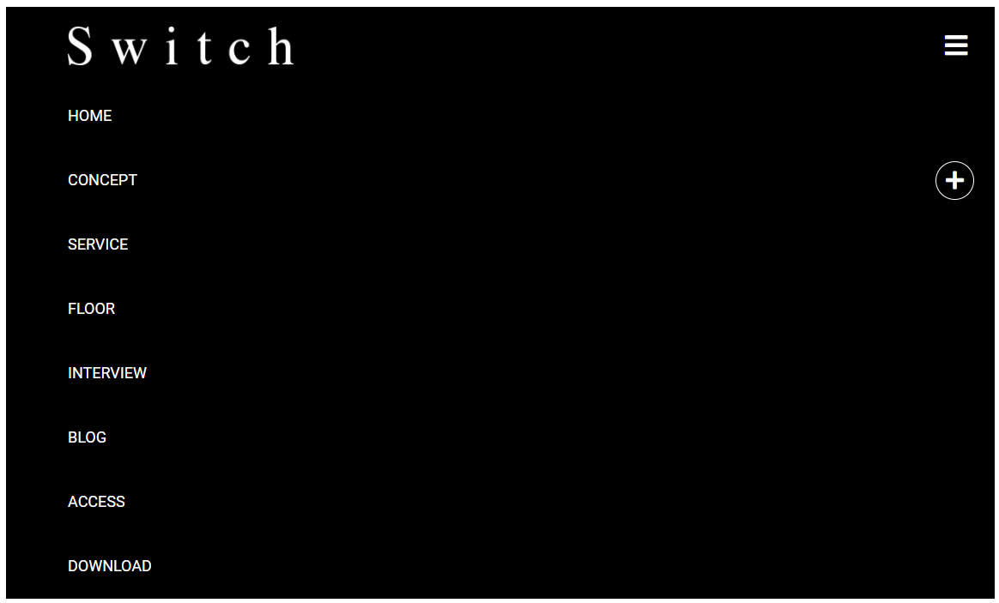
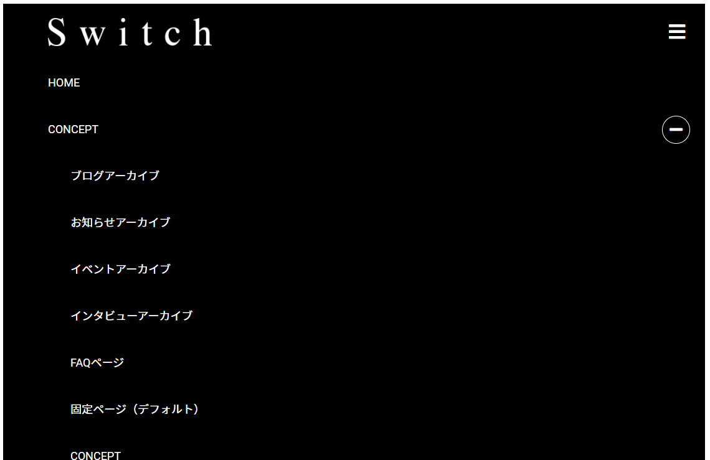

### 作るもの







### ファイル名、ディレクトリ構造

```
src
├ components
│ └ organisms
│   └ header
│     ├ header.html
│     └ header.scss
└ stories
  └ organisms-header.stories.js
```

### コンポーネントのあるページ

[header](https://www.figma.com/file/itngQHR9R5RB7xwCXAKOde/?node-id=781%3A1012)

### 注意点

- 今回の課題の中で最も複雑な部品です。[bootstrap 公式ドキュメント](https://getbootstrap.com/docs/4.5/getting-started/introduction/)をよく読み、components の中から使える物を組み合わせて可能な限り簡潔に実装しましょう。
- また、細かいパーツの配置には css の flexbox を有効に活用しましょう。
- ホバー時の挙動も再現してください。
- 元サイトにおいて xl 以上の時に CONCEPT をホバーした際の動きは実装が難しいので、「CONCEPT をクリックでドロップダウンが開く」という実装でも許容します。余裕があればホバーで開くようにしてみてください。
- リンクの範囲も再現してください。
- ASSET にある logo は画像として、その他のアイコンは svg として export して使ってください。
- タブレット・スマホ表示時にハンバーガーアイコンや+ボタンをクリック（タップ）したときの挙動は**bootstrap のみ**を利用して実現しましょう。**本課題では javascript を書かないでください。**ドキュメントに載っているサンプルコードを読み解くことで使い方が分かるかもしれません。
- お手本ページでどのように配置されているかを考慮しましょう。背景にも注意してください。
- xl 以下の場合に concept の右の+ボタンを押すと-ボタンに変化しますが、この実装は若干難しいので、**+ボタンのままで大丈夫です。**実装方法を思いつく方はチャレンジしていただいてかまいません。
- 難易度の高い課題です。調べた上で分からないことがあれば積極的に質問してください。
