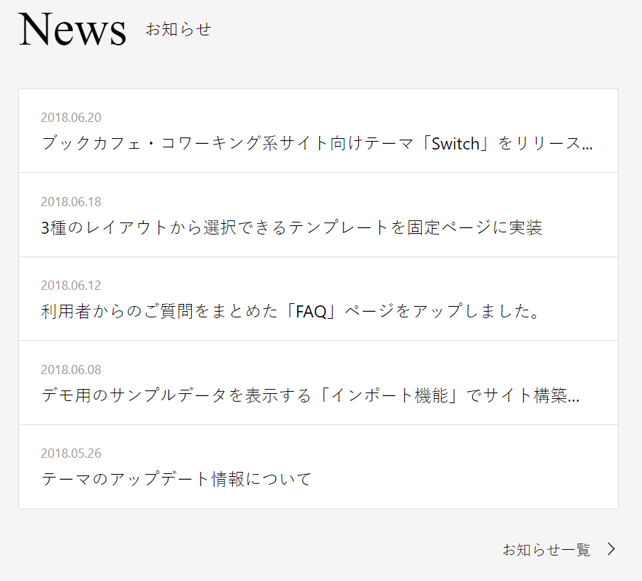

### 作るもの



### ファイル名、ディレクトリ構造

```
src
├ components
│ └ organisms
│   └ news
│     ├ news.html
│     └ news.scss
└ stories
  └ organisms-news.stories.js
```

### コンポーネントのあるページ

[news&events](https://www.figma.com/file/itngQHR9R5RB7xwCXAKOde/?node-id=820%3A0)

### 注意点

- molecules で作成した部品を利用しましょう。
- 一つ一つのニュースは独立した「記事」であることをタグで表しましょう。
- 枠線の重なりに注意して実装しましょう。
- Figmaにも書いてありますが、リストになっているところはhoverすると文字の色が変わります。hover時の挙動は、上記のFigmaリンクの左の方に載せてあるので、その通りになるようにしましょう。
