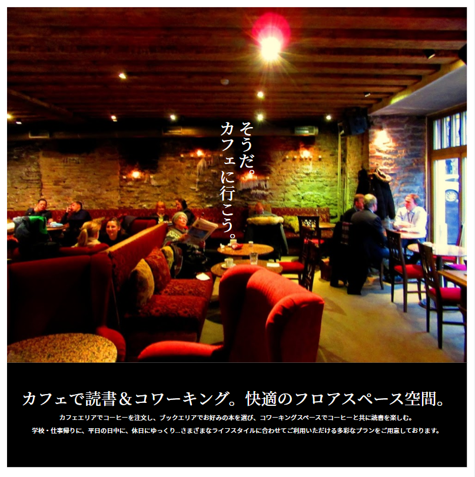

### 作るもの



### ファイル名、ディレクトリ構造

```
src
├ components
│ └ organisms
│   └ top
│     ├ top.html
│     └ top.scss
└ stories
  └ organisms-top.stories.js
```

### コンポーネントのあるページ

[top](https://www.figma.com/file/itngQHR9R5RB7xwCXAKOde/?node-id=797%3A0)

### 注意点

- パソコンやスマホサイズでも違和感なく表示されるようにしましょう。
- molecules で作成した message をもとに、色を追加しましょう。このパーツの message だけに新しくスタイルを追加するにはどうすれば良いでしょうか？
